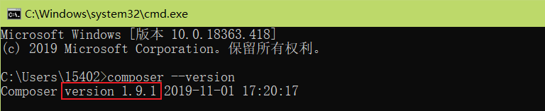

# composer 概述

> **composer** ？？？

​		Composer 是 PHP5.3以上 的一个依赖管理工具。它允许你声明项目所依赖的代码库，它会在你的项目中为你安装他们。Composer 不是一个包管理器。是的，它涉及 "packages" 和 "libraries"，但它在每个项目的基础上进行管理，在你项目的某个目录中（例如 vendor）进行安装。默认情况下它不会在全局安装任何东西。因此，这仅仅是一个**依赖管理**。

​		是 PHP 用来管理依赖（dependency）关系的工具。你可以在自己的项目中声明所依赖的外部工具库（libraries），Composer 会帮你安装这些依赖的库文件。有了它我们就可以轻松的使用一个命令将其他优秀代码引用到我们的项目中来。

> 为什么要用composer ？？？

​		对于现代语言而言，包管理器基本上是标配。Java 有 Maven，Python 有 pip，Ruby 有 gem，Nodejs 有 npm。PHP 的则是 PEAR，不过 PEAR 坑不少：

- 依赖处理容易出问题
- 配置非常复杂
- 难用的命令行接口

好在我们有 Composer，PHP依赖管理的利器。它是开源的，使用起来也很简单，提交自己的包也很容易。

# composer 安装

> composer 安装须知

- Composer 默认情况下不是全局安装，而是基于指定的项目的某个目录中（例如 vendor）进行安装。


- Composer 需要 PHP 5.3.2+ 以上版本，且需要开启 openssl。

- Composer 可运行在 Windows 、 Linux 以及 OSX 平台上。

## Wondows 平台

Wondows 平台上，我们只需要下载 [Composer-Setup.exe](https://www.phpcomposer.com/) 后，一步步安装即可。

需要注意的是你需要开启 openssl 配置，我们打开 php 目录下的 php.ini，将 extension=php_openssl.dll 前面的分号去掉就可以了。

安装成功后，我们可以通过命令窗口(cmd) 输入 **composer --version** 命令来查看是否安装成功：



更改为阿里云 Composer 全量镜像：

```bash
composer config -g repo.packagist composer https://mirrors.aliyun.com/composer/
```

取消配置：

```bash
composer config -g --unset repos.packagist
```

**项目配置**

仅修改当前项目配置，仅当前项目可使用该镜像地址：

```bash
composer config repo.packagist composer https://mirrors.aliyun.com/composer/
```

取消配置：

```bash
composer config --unset repos.packagist
```

**调试**

composer 命令增加 **-vvv** 可输出详细的信息，命令如下：

```bash
composer -vvv require alibabacloud/sdk
```

**遇到问题？**

1. 建议先将Composer版本升级到最新：

```bash
composer self-update
```

2. 执行诊断命令：

```bash
composer diagnose
```

3. 清除缓存：

```bash
composer clear
```

4. 若项目之前已通过其他源安装，则需要更新 composer.lock 文件，执行命令：

```bash
composer update --lock
```

## Linux 平台

Linux 平台可以使用以下命令来安装：

```bash
# php -r "copy('https://install.phpcomposer.com/installer', 'composer-setup.php');"
# php composer-setup.php

All settings correct for using Composer
Downloading...

Composer (version 1.6.5) successfully installed to: /root/composer.phar
Use it: php composer.phar
```

移动 composer.phar，这样 composer 就可以进行全局调用：

```bash
# mv composer.phar /usr/local/bin/composer
```

切换为国内镜像：

```bash
# composer config -g repo.packagist composer https://mirrors.aliyun.com/composer/
```

更新 composer：

```bash
# composer selfupdate
```

## Mac OS 系统

Mac OS 系统可以使用以下命令来安装：

```bash
$ curl -sS https://getcomposer.org/installer | php
$ sudo mv composer.phar /usr/local/bin/composer
$ composer --version
Composer version 1.7.2 2018-08-16 16:57:12
```

切换为国内镜像：

```bash
$ composer config -g repo.packagist composer https://mirrors.aliyun.com/composer/
```

更新 composer：

```bash
$ composer selfupdate
```

# Composer 的使用

## 基础使用

> 要使用 Composer，我们需要先在项目的目录下创建一个 composer.json 文件，文件描述了项目的依赖关系。

文件格式如下：

```bash
{
    "require": {
        "monolog/monolog": "1.2.*"
    }
}
```

以上文件说明我们需要下载从 1.2 开始的任何版本的 monolog。

接下来只要运行以下命令即可安装依赖包：

```bash
composer install
```

**require** 命令

除了使用 install 命令外，我们也可以使用 require 命令快速的安装一个依赖而不需要手动在 composer.json 里添加依赖信息：

```bash
$ composer require monolog/monolog
```

Composer 会先找到合适的版本，然后更新composer.json文件，在 require 那添加 monolog/monolog 包的相关信息，再把相关的依赖下载下来进行安装，最后更新 composer.lock 文件并生成 php 的自动加载文件。

**update** 命令

update 命令用于更新项目里所有的包，或者指定的某些包：

```bash
# 更新所有依赖
$ composer update

# 更新指定的包
$ composer update monolog/monolog

# 更新指定的多个包
$ composer update monolog/monolog symfony/dependency-injection

# 还可以通过通配符匹配包
$ composer update monolog/monolog symfony/*
```

需要注意的时，包能升级的版本会受到版本约束的约束，包不会升级到超出约束的版本的范围。例如如果 composer.json 里包的版本约束为 ^1.10，而最新版本为 2.0。那么 update 命令是不能把包升级到 2.0 版本的，只能最高升级到 1.x 版本。

**remove** 命令

remove 命令用于移除一个包及其依赖（在依赖没有被其他包使用的情况下），如果依赖被其他包使用，则无法移除：

```bash
$ composer remove monolog/monolog
Loading composer repositories with package information
Updating dependencies (including require-dev)
Package operations: 0 installs, 0 updates, 2 removals
  - Removing psr/log (1.0.2)
  - Removing monolog/monolog (1.23.0)
Generating autoload files
```

**search** 命令

search 命令可以搜索包：

```bash
$ composer search monolog
```

该命令会输出包及其描述信息，如果只想输出包名可以使用 **--only-name** 参数：

```bash
$ composer search --only-name monolog
```

**show** 命令

show 命令可以列出当前项目使用到包的信息：

```bash
# 列出所有已经安装的包
$ composer show

# 可以通过通配符进行筛选
$ composer show monolog/*

# 显示具体某个包的信息
$ composer show monolog/monolog
```

## 安装依赖包

获取定义的依赖到你的本地项目，只需要调用 composer.phar 运行 **install** 命令。

```bash
php composer.phar install
```

接着前面的例子，这将会找到 monolog/monolog 的最新版本，并将它下载到 **vendor** 目录。 这是一个惯例把第三方的代码到一个指定的目录 vendor。如果是 monolog 将会创建 vendor/monolog/monolog 目录。

另一件事是 install 命令将创建一个 **composer.lock** 文件到你项目的根目录中。

当 Composer 完成安装后，它将把所有下载的包和确切的版本信息写入到 composer.lock 文件，以此来**锁定项目中第三方包的版本**。你应该将 composer.lock 放在项目仓库中，以便该项目所有成员都能锁定在依赖关系相同的版本

**小技巧：** 如果你正在使用Git来管理你的项目， 你可能要添加 `vendor` 到你的 `.gitignore` 文件中。 你不会希望将所有的代码都添加到你的版本库中。(**因为将所有第三方包添加到版本库里面看起来很傻**)

## composer.lock - 锁文件

在安装依赖后，Composer 将把安装时确切的版本号列表写入 `composer.lock` 文件。这将锁定改项目的特定版本。

请提交你应用程序的 **composer.lock** （包括 **composer.json**）到你的版本库中

这是非常重要的，因为 install 命令将会检查锁文件是否存在，如果存在，它将下载指定的版本（忽略 composer.json 文件中的定义）。

这意味着，任何人建立项目都将下载与指定版本完全相同的依赖。你的持续集成服务器、生产环境、你团队中的其他开发人员、每件事、每个人都使用相同的依赖，从而减轻潜在的错误对部署的影响。即使你独自开发项目，在六个月内重新安装项目时，你也可以放心的继续工作，即使从那时起你的依赖已经发布了许多新的版本。

**如果不存在 `composer.lock` 文件，Composer 将读取 `composer.json` 并创建锁文件。**

这意味着如果你的依赖更新了新的版本，你将不会获得任何更新。此时要更新你的依赖版本请使用 `update` 命令。这将获取最新匹配的版本（根据你的 `composer.json` 文件）并将新版本更新进锁文件。

```bash
php composer.phar update
```

如果只想安装或更新一个依赖，你可以白名单它们：

```ba
php composer.phar update monolog/monolog [...]
```

## Packagist

[packagist](https://packagist.org/) 是 Composer 的主要资源库。 一个 Composer 的库基本上是一个包的源：记录了可以得到包的地方。Packagist 的目标是成为大家使用库资源的中央存储平台。这意味着你可以 `require` 那里的任何包。

当你访问 [packagist website](https://packagist.org/) (packagist.org)，你可以浏览和搜索资源包。

任何支持 Composer 的开源项目应该发布自己的包在 packagist 上。虽然并不一定要发布在 packagist 上来使用 Composer，但它使我们的编程生活更加轻松。

## 自动加载

对于库的自动加载信息，Composer 生成了一个 `vendor/autoload.php` 文件。你可以简单的引入这个文件，你会得到一个免费的自动加载支持。

```php
require 'vendor/autoload.php';
```

这使得你可以很容易的使用第三方代码。例如：如果你的项目依赖 monolog，你就可以像这样开始使用这个类库，并且他们将被自动加载。

```php
$log = new Monolog\Logger('name');
$log->pushHandler(new Monolog\Handler\StreamHandler('app.log', Monolog\Logger::WARNING));

$log->addWarning('Foo');
```

你可以在 `composer.json` 的 `autoload` 字段中增加自己的 autoloader。

```ba
{
    "autoload": {
        "psr-4": {"Acme\\": "src/"}
    }
}
```

Composer 将注册一个 [PSR-4](http://www.php-fig.org/psr/psr-4/) autoloader 到 `Acme` 命名空间。

你可以定义一个从命名空间到目录的映射。此时 `src` 会在你项目的根目录，与 `vendor` 文件夹同级。例如 `src/Foo.php` 文件应该包含 `Acme\Foo` 类。

添加 `autoload` 字段后，你应该再次运行 `install` 命令来生成 `vendor/autoload.php` 文件。

引用这个文件也将返回 autoloader 的实例，你可以将包含调用的返回值存储在变量中，并添加更多的命名空间。这对于在一个测试套件中自动加载类文件是非常有用的，例如

```php
$loader = require 'vendor/autoload.php';
$loader->add('Acme\\Test\\', __DIR__);
```

除了 PSR-4 自动加载，classmap 也是支持的。这允许类被自动加载，即使不符合 PSR-0 规范。

**注意：** Composer 提供了自己的 autoloader。如果你不想使用它，你可以仅仅引入 `vendor/composer/autoload_*.php` 文件，它返回一个关联数组，你可以通过这个关联数组配置自己的 autoloader。

## 镜像列表

| 镜像名                      | 地址                                         | 赞助商   | 更新频率 | 备注   |
| :-------------------------- | :------------------------------------------- | :------- | :------- | :----- |
| 阿里云 Composer 镜像        | https://mirrors.aliyun.com/composer/         | 阿里云   | 96 秒    | 推荐   |
| 腾讯云 Composer 镜像        | https://mirrors.cloud.tencent.com/composer/  | 腾讯云   | 24 小时  | -      |
| PHP 国内 Composer 镜像      | https://packagist.phpcomposer.com            | 仁润股份 | 24 小时  | 不稳定 |
| 华为云 Composer 镜像        | https://repo.huaweicloud.com/repository/php/ | 华为云   | 未知     | 未知   |
| php.cnpkg.org Composer 镜像 | https://php.cnpkg.org                        | 安畅网络 | 60 秒    | -      |

**配置镜像**

全局配置镜像，以下为阿里云镜像配置命令，其它镜像可以参考以下命令。

```bash
composer config -g repos.packagist composer https://mirrors.aliyun.com/composer/
```

如果需要解除镜像并恢复到 packagist 官方源，请执行以下命令：

```bash
composer config -g --unset repos.packagist
```

