# Redis

## NoSQL

### 为什么要用 NoSQL ？

> 1、 单机 MySQL 的美好时代

​		在90年代，一个基本的网站访问量一般不会太大，用单个数据库完全可以轻松应付。在那个时候，更多的都是静态网页，动态交互类型的网站并不多。服务器根本没有太大的压力！

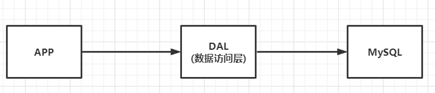

DAL：dal是数据访问层的英文缩写，即为数据访问层（Data Access Layer）。其功能主要是负责数据库的访问。简单地说就是实现对数据表的Select（查询）、Insert（插入）、Update（更新）、Delete（删除）等操作。

​		这种情况下，数据存储的瓶颈是什么？

- 数据量如果太大，一个机器放不下
- 数据的索引（B + Tree），一个机器的内存也放不下（单表超过300万就一定要建立索引了）
- 访问量（读写混合），一个服务器承受不了

如果满足了上述1 or 3个条件时，只能对数据库的整体架构进行重构

> 2、Memcached（缓存） + MySQL + 垂直拆分

​		后来，随着访问量的上升，几乎大部分使用MySQL架构的网站在数据库上都开始出现了性能问题，web程序不再仅仅专注在功能上，同时也在追求性能。程序员们开始大量的使用缓存技术来缓解数据库的压力，优化数据库的结构和索引。开始比较流行的是通过文件缓存来缓解数据库压力，但是当访问量继续增大的时候，多台web机器文件缓存不能共享，大量的小文件缓存也带了比较高的IO压力。在这个时候，**Memcached** 就自然的成为一个非常时尚的技术产品。

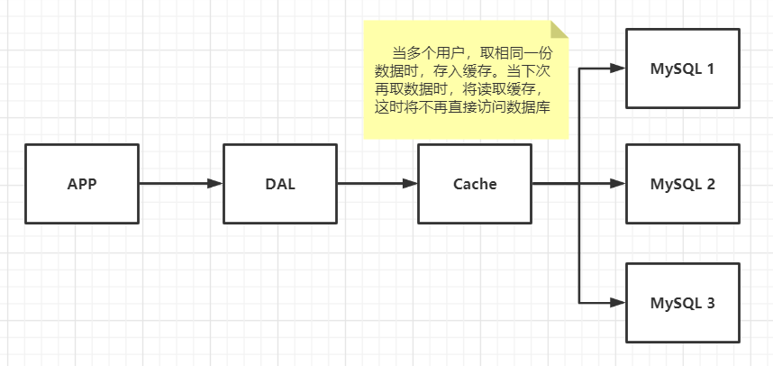

发展过程：

优化数据结构和索引 ➠ 文件缓存（IO）➠ Memcached（当时最热门的技术!）

​		Memcached作为一个独立的分布式的缓存服务器，为多个web服务器提供了一个共享的高性能缓存服务，在Memcached服务器上，又发展了根据hash算法来进行多台Memcached缓存服务的扩展，然后又出现了一致性hash来解决增加或减少缓存服务器导致重新hash带来的大量缓存失效的弊端。

​		网站80%的情况都是在读，每次都要去查数据库的话就很麻烦，所以说我们希望减轻数据库的压力，从而要使用缓存来保证效率。

> 3、MySQL 主从读写分离

​		由于数据库的写入压力增加，Memcached只能缓解数据库的读取压力。读写集中在一个数据库上让数据库不堪重负，大部分网站开始使用主从复制技术来达到读写分离，以提高读写性能和读库的可扩展性。Mysql的master-slave模式成为这个时候的网站标配了。

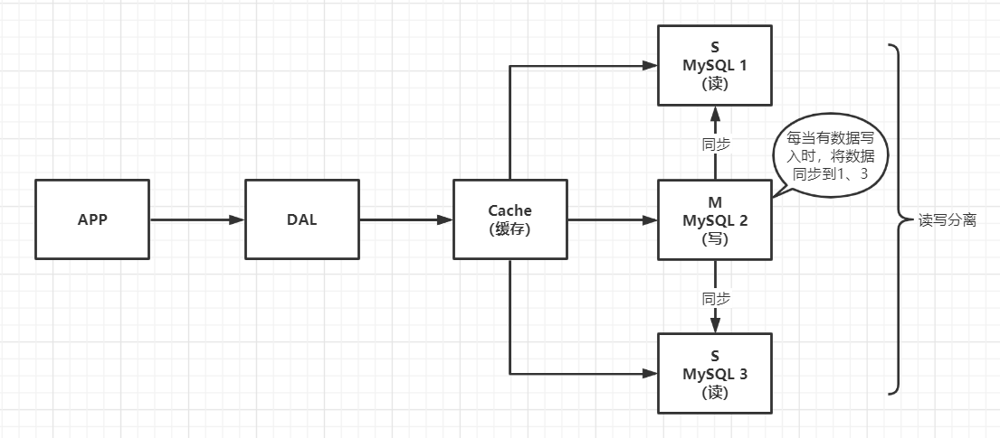

> 4、分库分表 + 水平拆分 + MySQL集群

​		在Memcached的高速缓存，MySQL的主从复制，读写分离的基础之上，这时MySQL主库的写压力开始出现瓶颈，而数据量的持续猛增，由于MyISAM在写数据的时候会使用表锁，在高并发写数据的情况下会出现严重的锁问题，大量的高并发MySQL应用开始使用InnoDB引擎代替MyISAM。

​		ps：这就是为什么 MySQL 在 5.6 版本之后使用 InnoDB 做为默认存储引擎的原因 – MyISAM 写会锁表，InnoDB 有行锁，发生冲突的几率低，并发性能高。

​		同时，开始流行使用分表分库来缓解写压力和数据增长的扩展问题。这个时候，分表分库成了一个热门技术，是面试的热门问题也是业界讨论的热门技术问题。也就在这个时候，MySQL推出了还不太稳定的表分区，这也给技术实力一般的公司带来了希望。虽然MySQL推出了MySQL Cluster集群，但性能也不能很好满足互联网的要求，只是在高可靠性上提供了非常大的保证。

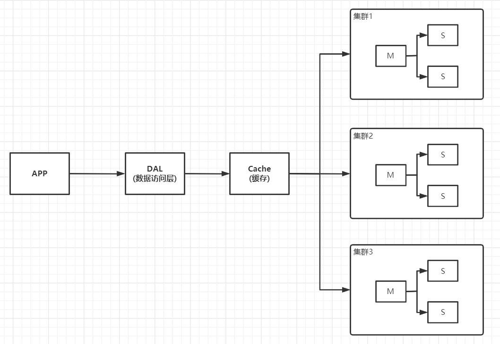

优化的本质：数据库（读、写），终究是为了解决读写问题

发展过程：

- 上面缓存的加入，解决了读的问题

- 早些年MyISAM：表锁，十分影响效率！高并发下会出现严重的锁问题

- 转战InnoDB：行锁

- 逐渐开始使用分库分表来解决写的压力

- MySQL在那个年代虽然推出了表分区，但并没有得到广泛使用，而后来MySQL集群的出现，在高可靠性上提供了非常大的保证

>   MySQL的扩展性瓶颈？

​		MySQL数据库也经常存储一些大文本字段，导致数据库表非常的大，在做数据库恢复的时候就导致非常的慢，不容易快速恢复数据库。比如1000万4KB大小的文本就接近40GB的大小，如果能把这些数据从MySQL省去，MySQL将变得非常的小。关系数据库很强大，但是它并不能很好的应付所有的应用场景。MySQL的扩展性差（需要复杂的技术来实现），大数据下IO压力大，表结构更改困难，正是当前使用MySQL的开发人员面临的问题。

> 如今...

​		2010--2020 十年之间，世界已经发生了翻天覆地的变化

​		MySQL等关系型数据库就不够用了，使用它来存储一些比较大的数据，数据表就很大、效率低；大数据的IO压力下，表结构几乎无法更改

​		如果有一种数据库来专门处理这些数据，就能减小MySQL的压力....该如何解决此问题？

目前一个基本的互联网项目：

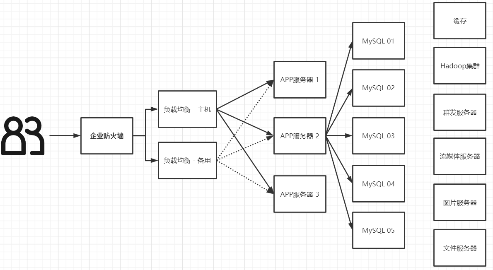

最前面的是企业级防火墙，后面通过负载均衡主机（软负载：Nginx，硬负载：F5）在 web 服务器集群之间进行调度，再由具体的 web 服务器去访问缓存，访问数据库。

> 为什么要用NoSQL？

​		今天我们可以通过第三方平台（如：Google,Facebook等）可以很容易的访问和抓取数据。用户的个人信息，社交网络，地理位置，用户生成的数据和用户操作日志已经成倍的增加。我们如果要对这些用户数据进行挖掘，那SQL数据库已经不适合这些应用了, NoSQL数据库的发展却能很好的处理这些大的数据。

​		用户的个人信息、社交网络、地理位置...用户自己产生的数据、日志等等爆发式增长，这时候我们就需要使用NoSQL数据库，以解决以上问题。

### 什么是NoSQL？

> NoSQL 概述

​		NoSQL：Not Only SQL （不仅仅是SQL）泛指非关系型的数据库

​		随着互联网web2.0网站的兴起，传统的关系型数据库很难应付web2.0时代，特别是超大规模和高并发的SNS（社交网络服务：社交软件、社交网站）类型的web2.0纯动态网站已经显得力不从心，暴露出来很多难以克服的问题，而非关系型的数据库则由于其本身的特点得到了非常迅速的发展。NoSQL数据库的产生就是为了解决大规模数据集合多重数据种类带来的挑战，尤其是大数据应用难题，包括超大规模数据的存储。

​		很多类型的数据，如用户的个人信息、社交网络、地理位置...这些类型的数据存储不需要一个固定的格式，不需要多余的操作就可以横向扩展。

​		NoSQL在当今大数据环境下发展得十分迅速，其中Redis发展最快，而且是我们当下必须要掌握的一个技术。 

> 传统 RDBMS 与 NoSQL 的区别？

**RDBMS（关系型数据库）**：

​		指采用了关系模型来组织数据的数据库

​		关系模型指的就是二维表格模型，而一个关系型数据库就是由二维表及其之间的联系所组成的一个数据组织。

- 高度组织化结构化数据
- 结构化查询语言（SQL）
- 数据和关系都存储在单独的表中
- 数据操纵语言，数据定义语言
- 严格的一致性
- 基础事务，遵循ACID规则

ACID：

- Atomicity（原子性）：事务里的所有操作要么全部做完，要么都不做，事务成功的条件是事务里的所有操作都成功，只要有一个操作失败，整个事务就失败，需要回滚
- Consistency（一致性）：数据库要一直处于一致的状态，事务的运行不会改变数据库原本的一致性约束
- Isolation（隔离型）：指并发的事务之间不会互相影响，如果一个事务要访问的数据正在被另外一个事务修改，只要另外一个事务未提交，它所访问的数据就不受未提交事务的影响
- Durability（持久性）：指一旦事务提交后，它所做的修改将会永久的保存在数据库上，即使出现宕机也不会丢失

**NoSQL（非关系型数据库）**：

​		指非关系型的，分布式的，且一般不保证遵循ACID原则的数据存储系统

​		非关系型数据库以键值对存储，且结构不固定，每一个元组可以有不一样的字段，每个元组可以根据需要增加一些自己的键值对，不局限于固定的结构，可以减少一些时间和空间的开销。

- 代表着不仅仅是SQL
- 没有声明性查询语言，没有预定义的模式
- 键 - 值对存储、列存储、文档存储、图形数据库
- 最终一致性，而非ACID属性
- CAP定理、BASE原理
- 高性能，高可用、高可扩

BASE：

- Basically Available（BA 基本可用）：NoSQL允许分布式系统中某些部分出现故障，那么系统的其余部分依然可用。它不会像ACID那样，在系统出现故障时，进行强制拒绝，允许继续部分访问。

- Soft State（软状态）：NoSQL在数据处理过程中，允许这个过程，存在数据状态暂时不一致的情况。但经过纠错处理，最终会一致的。

- Eventually Consistent（最终一致性）：NoSQL的软状态允许数据处理过程的暂时不一致，但是最终处理结果将是一致的，说明NoSQL对数据处理过程可以有短暂的时间间隔，也允许分更细的步骤一个一个地处理，最好数据达到一致即可。这在互联网上进行分布式应用具有其明显的优势。

  BASE是NoSQL数据库通常对可用性及一致性的弱要求原则

CAP：

- Consistency（一致性）：所有节点在同一时间具有相同的数据

- Availability（可用性）：保证每个请求不管成功或者失败都有响应

- Partition tolerance（分区容错性）：系统中任意信息的丢失或失败不会影响系统的继续运作

  定理：任何分布式系统只可同时满足二点，没法三者兼顾。鱼和熊掌不可兼得！

​       CAP理论的核心是：一个分布式系统不可能同时很好的满足一致性，可用性和分区容错性这三个需求，因此，根据 CAP 原理将 NoSQL 数据库分成了满足 CA 原则、满足 CP 原则和满足 AP 原则三 大类

> NoSQL特点

- 方便扩展（数据之间没有关系，很好扩展）
- 大数据量高性能（Redis一秒可以写8万次、读取11万次，NoSQL的缓存记录级，是一种细粒度的缓存，性能会比较高）

- 数据类型是多样型的（不需要事先设计数据库，随取随用）

### NoSQL四大分类

- **KV键值对 **如：Redis、Memcached
- **文档型数据库（bson格式，和json一样）** 如：MongoDB、ConthDB
- **列存储数据库**  如：HBase、分布式文件系统
- **图关系数据库 ** 如：Neo4j、InfoGrid


## Redis入门

### 概述

> Redis是什么？

Redis是一个由Salvatore Sanfilippo写的key-value存储系统。

Redis（Remote Dictionary Server )，即远程字典服务，是一个开源的使用ANSI **C语言**编写、遵守BSD协议、支持网络、可基于内存亦可持久化的日志型、Key-Value数据库，并提供多种语言的API。

它通常被称为数据结构服务器，因为值（value）可以是 字符串(String), 哈希(Map), 列表(list), 集合(sets) 和 有序集合(sorted sets)等类型。

与memcached一样，为了保证效率，数据都是缓存在内存中。区别的是redis会周期性的把更新的数据写入磁盘或者把修改操作写入追加的记录文件，并且在此基础上实现了master-slave(主从)同步。

Redis 是当下最热门的NoSQL技术之一，也被人们称之为结构化数据库

> Redis能干嘛？

1. 内存存储、持久化。内存是断电即失的、所以说持久化很重要（rdb、aof）
2. 效率高，可以用于高速缓存
3. 可用于发布订阅系统、地图信息分析、计时器、计数器、浏览量...

> 特性

多样的数据类型

1. 持久化

2. 集群

3. 事务

   ...

### 性能测试

**redis-benchmark** 压力测试工具，官方自带的性能测试工具

简单测试：

```bash
# 测试：100个并发连接 100000请求
redis-benchmark -h localhost -p 6379 -c 100 -n 100000
```

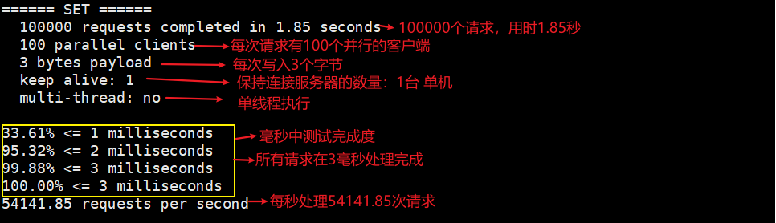

### 基础知识

redis默认有16个数据库，默认使用的是第0个

基本命令：

```bash
127.0.0.1:6379> select 1       # 切换数据库
OK
127.0.0.1:6379> DBSIZE         # 查看DB大小
(integer) 1
127.0.0.1:6379> keys *         # 查看数据库的所有key
1) "name"
127.0.0.1:6379> exists name	   # 判断当前key是否存在
(integer) 1
127.0.0.1:6379> type name	   # 查看当前key类型
string
127.0.0.1:6379> expire name 30 # 设置key的过期时间，单位：秒
(integer) 1
127.0.0.1:6379> ttl name       # 获取当前key剩余的过期时间
(integer) 25
127.0.0.1:6379> ttl name 
(integer) 9
127.0.0.1:6379> ttl name 
(integer) -2			       # 如果key不存在或者已过期，返回 -2 如果key存在并且没有设置过期时间（永久有效），返回 -1
127.0.0.1:6379> get name
(nil)
127.0.0.1:6379> flushdb        # 清除当前数据库的内容
OK
127.0.0.1:6379> flushall       # 清除所有数据库的内容
OK
```

> Redis是单线程的！

官方表示，Redis是 基于内存操作，CPU不是Redis性能瓶颈，Redis瓶颈是根据机器的内存和网络带宽而定；既然可以使用单线程来实现，那就使用单线程了！所以就使用了单线程

Redis 是C语言写的，官方提供的数据为 100000+ 的QPS，完全不比同样是使用 key-value 的memcached差

**Redis 为什么单线程还那么快？**

- 误区1：高性能的服务器一定是多线程的？
- 误区2：多线程一定比单线程效率高？
- 多线程：CPU上下文会切换，耗时的操作

Redis 是将所有的数据全部存放在内存中的，所以说使用单线程去操作效率就是最高的，对于内存系统来说，如果没有上下文切换效率就是最高的。多次读写都是在一个CUP上进行的，在内存情况下，这个就是最佳的方案！


redis 与 memcached 相比的独特之处：

1. redis 可以用来做存储（storage），而 memcached 是用来做缓存（cache），这个特点主要是其有“持久化”的功能
2. 存储的数据有“结构”，对于 memcached 来说存储的数据只有一种类型（字符串），而 redis 则可以存储字符串、链表、哈希、集合、有序集合

主要文件：

- redis-benchmark redis性能测试工具
- redis-check-aof 检查aof日志的工具
- redis-check-rdb 检查rbd日志的工具
- redis-cli 连接用的客户端
- redis-server redis 服务进程
- redis-sentinel 哨兵模式


## 五大数据类型

### String（字符串）

string类型的使用场景：value除了可以是字符串还可以是数字

- 计数器
- 粉丝数
- 对象缓存储存
- 统计多单位的数量

```bash
##########################################################################################

127.0.0.1:6379> set name zhangsan  	  # 设置值
OK
127.0.0.1:6379> get name			  # 获取值
"zhangsan"
127.0.0.1:6379> keys *				  # 获取所有的key
1) "name"
127.0.0.1:6379> exists name			  # 判断某一个key是否存在
(integer) 1
127.0.0.1:6379> append name ", hello" # 追加字符串 如果当前key不存在，就相当于set key
(integer) 15
127.0.0.1:6379> get name
"zhangsan, hello"
127.0.0.1:6379> strlen name			  # 获取字符串的长度
(integer) 15

##########################################################################################

# i++ i--
# 步长 i+= i-=
127.0.0.1:6379> set views 0 	# 设置初始浏览量为 0
OK
127.0.0.1:6379> get views
"0"
127.0.0.1:6379> incr views 		# 自增 1
(integer) 1
127.0.0.1:6379> incr views
(integer) 2
127.0.0.1:6379> get views
"2"								# 浏览量变为 2
127.0.0.1:6379> decr views		# 自减 1
(integer) 1
127.0.0.1:6379> decr views
(integer) 0
127.0.0.1:6379> get views
"0"								# 浏览量变为 0
127.0.0.1:6379> incrby views 10	# 设置步长 10，递增
(integer) 10
127.0.0.1:6379> incrby views 20
(integer) 30
127.0.0.1:6379> get views
"30"							# 浏览量变为 30
127.0.0.1:6379> decrby views 10	# 设置步长 10，递减
(integer) 20
127.0.0.1:6379> decrby views 20
(integer) 0
127.0.0.1:6379> get views
"0"								# 浏览量变为 0

##########################################################################################

# 截取字符串 getrange
127.0.0.1:6379> set str "ABCDEFG"
OK
127.0.0.1:6379> get str
"ABCDEFG"
127.0.0.1:6379> getrange str 0 3 	# 截取字符串 [0, 3]
"ABCD"
127.0.0.1:6379> getrange str 0 -1	# 获取全部的字符串 （和 get key 是一样的）
"ABCDEFG"

# 替换指定位置开始的字符串 setrange
127.0.0.1:6379> get str
"ABCDEFG"
127.0.0.1:6379> setrange str 4 efg	# 替换掉从第一个字符开始算起，第四个后面的字符
(integer) 7
127.0.0.1:6379> get str
"ABCDefg"

##########################################################################################

# setex（set with expire） 设置过期时间 
127.0.0.1:6379> setex tempstr 10 "hello world" # 设置 tempstr 的值为 hello world，10秒后过期
OK
127.0.0.1:6379> ttl tempstr
(integer) 4
127.0.0.1:6379> get tempstr
(nil)

# setnx（set if not exist） 不存在则创建（分布式锁中常常使用）
127.0.0.1:6379> keys *
1) "db1"
127.0.0.1:6379> get db1
"MySQL"
127.0.0.1:6379> setnx db2 "Redis"  	 # 如果 db2 不存在，则创建
(integer) 1
127.0.0.1:6379> get db2
"Redis"
127.0.0.1:6379> setnx db1 "MongoDB"	 # 如果 db1 已存在，则创建失败
(integer) 0
127.0.0.1:6379> get db1
"MySQL"

##########################################################################################

# mset 批量设置
# mget 批量获取
127.0.0.1:6379> mset k1 v1 k2 v2 k3 v3  # 批量设置多个key
OK
127.0.0.1:6379> keys *
1) "k2"
2) "k1"
3) "k3"
127.0.0.1:6379> mget k1 k2 k3			# 批量获取多个key
1) "v1"
2) "v2"
3) "v3"
127.0.0.1:6379> msetnx k1 v1 k4 v4		# msetnx 是一个原子性的操作 要么一起成功，要么一起失败！
(integer) 0
127.0.0.1:6379> get k4
(nil)

##########################################################################################

# 创建对象

# 设置一个 user:1 对象，值为 json 字符串来保存一个对象
127.0.0.1:6379> set user:1 {name:zhangsan,age:17}
OK
127.0.0.1:6379> get user:1
"{name:zhangsan,age:17}"

# 这里的 key 是一个巧妙的设计：user:{id}:{filed}
127.0.0.1:6379> mset user:1:name lisi user:1:age 18
OK
127.0.0.1:6379> mget user:1:name user:1:age
1) "lisi"
2) "18"

##########################################################################################

# getset 先get然后再set
127.0.0.1:6379> getset db redis		# 如果key不存在 则返回nil，并创建
(nil)
127.0.0.1:6379> get db			
"redis"
127.0.0.1:6379> getset db mongodb	# 如果key存在 返回原来的值，并设置新的值
"redis"
127.0.0.1:6379> get db
"mongodb"

##########################################################################################
```


### List（列表）

在Redis中，list可以充当栈、队列、阻塞队列

所用的list命令都是以 L 开头的

```bash
##########################################################################################

# Lpush  将一个或多个值插入到列表头部
# Rpush  将一个或多个值插入到列表尾部
# Lrange 获取列表指定范围内的元素
127.0.0.1:6379> lpush list one    # 将一个或多个值，插入到列表头部（左）
(integer) 1
127.0.0.1:6379> lpush list two
(integer) 2
127.0.0.1:6379> lpush list three
(integer) 3
127.0.0.1:6379> lrange list 0 -1  # 获取list中的所有值
1) "three"
2) "two"
3) "one"
127.0.0.1:6379> lrange list 0 1   # 通过区间获取列表中具体的值
1) "three"
2) "two"
127.0.0.1:6379> rpush list right  # 将一个或多个值，插入到列表的尾部（右）
(integer) 4
127.0.0.1:6379> lrange list 0 -1
1) "three"
2) "two"
3) "one"
4) "right"

##########################################################################################

# Lpop 移除并获取列表的第一个元素
# Rpop 移除并获取列表最后一个元素
127.0.0.1:6379> lrange list 0 -1
1) "three"
2) "two"
3) "one"
4) "right"
127.0.0.1:6379> lpop list	# 移除list的第一个元素
"three"
127.0.0.1:6379> rpop list	# 移除list的最后一个元素
"right"
127.0.0.1:6379> lrange list 0 -1
1) "two"
2) "one"

##########################################################################################

# Lindex 通过下标获取列表中的元素
127.0.0.1:6379> lrange list 0 -1
1) "two"
2) "one"
127.0.0.1:6379> lindex list 0	# 通过下标获取 list 中的某一个元素
"two"
127.0.0.1:6379> lindex list 1
"one"

##########################################################################################

#Llen 获取列表长度
127.0.0.1:6379> lrange list 0 -1
1) "two"
2) "one"
127.0.0.1:6379> llen list	# 返回列表的长度
(integer) 2

##########################################################################################

# Lrem 移除列表中指定的元素并指定移除个数
127.0.0.1:6379> lrange list 0 -1
1) "three"
2) "three"
3) "two"
4) "one"
127.0.0.1:6379> lrem list 1 two		# 移除list集合中指定个数的value （精确匹配）
(integer) 1
127.0.0.1:6379> lrem list 2 three
(integer) 2
127.0.0.1:6379> lrange list 0 -1
1) "one"

##########################################################################################

# Ltrim 对一个列表进行修剪(trim)，就是说，让列表只保留指定区间内的元素，不在指定区间之内的元素都将被删除
127.0.0.1:6379> lrange list 0 -1
1) "four"
2) "three"
3) "two"
4) "one"
127.0.0.1:6379> ltrim list 1 2	# 通过下标截取指定的长度（这个list已经被改变了，只剩下截取的元素）
OK
127.0.0.1:6379> lrange list 0 -1
1) "three"
2) "two"

##########################################################################################

# rpoplpush 移除列表的最后一个元素，并将该元素添加到另一个列表并返回
127.0.0.1:6379> lrange mylist 0 -1
1) "three"
2) "two"
3) "one"
127.0.0.1:6379> rpoplpush mylist otherlist	# 移除列表中的最后一个元素，并将它移动到新的列表中
"one"
127.0.0.1:6379> lrange mylist 0 -1
1) "three"
2) "two"	# 源列表中 one 元素已被移除
127.0.0.1:6379> lrange otherlist 0 -1
1) "one"	# 目标列表新增 one 元素

##########################################################################################

# Lset 将列表中指定下标的值替换为另一个值（更新操作）
127.0.0.1:6379> exists list		  # 判断该列表是否存在
(integer) 0
127.0.0.1:6379> lset list o item  # 更新一个不存在的列表 报错！
(error) ERR no such key
127.0.0.1:6379> lpush list value
(integer) 1
127.0.0.1:6379> lrange list 0 -1 
1) "value"
127.0.0.1:6379> lset list 0 item  # 正常更新列表指定下标的值
OK
127.0.0.1:6379> lrange list 0 -1
1) "item"						  # 该下标的值已被改变
127.0.0.1:6379> lset list 1 other # 更新一个存在的列表，但不存在的下标 报错！
(error) ERR index out of range

##########################################################################################

# linsert 在列表中的某一个元素之前或之后插入一个元素（插入操作）
 127.0.0.1:6379> lrange mylist 0 -1
1) "hello"
2) "world"
127.0.0.1:6379> linsert mylist before "world" "this"	# world 之前插入
(integer) 3
127.0.0.1:6379> lrange mylist 0 -1
1) "hello"
2) "this"
3) "world"
127.0.0.1:6379> linsert mylist after "world" "ending"		# world 之后插入
(integer) 4
127.0.0.1:6379> lrange mylist 0 -1
1) "hello"
2) "this"
3) "world"
4) "ending"

##########################################################################################
```

> 小结

- List 实际上是一个链表，before Node after、left、right 都可以插入值
- 如果key不存在，创建新的链表
- 如果key存在，新增内容
- 如果移除了所有值，空链表也代表不存在
- 在两边插入或者改动值，效率最高；中间元素，相对来说效率会低一点
- 可用于消息排队、消息队列（Lpush Rpop） 栈（Lpush Lpop）


### Set（集合）

set 无序不重复集合

```bash
##########################################################################################

# sadd      添加一个或多个成员到集合中
# smembers  获取集合中所有的成员
# scard     获取集合中成员的个数
# sismember 判断一个指定的元素是否是集合的成员
# srem 		从集合中删除一个或多个成员
127.0.0.1:6379> sadd myset hello	  # 添加一个或多个成员到集合中
(integer) 1
127.0.0.1:6379> sadd myset world	
(integer) 1
127.0.0.1:6379> sadd myset world	  # 已经在集合中存在则忽略
(integer) 0
127.0.0.1:6379> smembers myset		  # 获取集合中所有的成员
1) "world"
2) "hello"
127.0.0.1:6379> scard myset			  # 获取集合中成员的个数
(integer) 2
127.0.0.1:6379> sismember myset hello # 判断一个指定的元素是否在集合中
(integer) 1
127.0.0.1:6379> sismember myset bye
(integer) 0
127.0.0.1:6379> srem myset hello	  # 从集合中删除一个或多个成员
(integer) 1
127.0.0.1:6379> smembers myset
1) "world"

##########################################################################################

# 随机
# srandmember 从集合中随机获取一个成员
# spop		  从集合中移除并返回一个或多个随机成员
127.0.0.1:6379> sadd myset A B C D E F
(integer) 6
127.0.0.1:6379> smembers myset
1) "B"
2) "D"
3) "C"
4) "F"
5) "A"
6) "E"
127.0.0.1:6379> srandmember myset	# 从集合中随机获取一个成员
"A"
127.0.0.1:6379> srandmember myset
"C"
127.0.0.1:6379> srandmember myset 2	# 从集合中随机获取两个成员
1) "F"
2) "D"
127.0.0.1:6379> srandmember myset 2
1) "C"
2) "B"
127.0.0.1:6379> spop myset 			# 从集合中随机移除一个成员
"B"
127.0.0.1:6379> 
127.0.0.1:6379> spop myset
"C"
127.0.0.1:6379> spop myset 2		# 从集合中随机移除两个成员
1) "F"
2) "A"
127.0.0.1:6379> smembers myset
1) "D"
2) "E"


##########################################################################################

# smove 移动集合中的一个成员到另一个集合
127.0.0.1:6379> smembers myset
1) "A"
2) "B"
127.0.0.1:6379> smembers otherset
1) "world"
2) "hello"
127.0.0.1:6379> smove myset otherset A
(integer) 1
127.0.0.1:6379> smembers myset
1) "B"
127.0.0.1:6379> smembers otherset
1) "A"
2) "world"
3) "hello"

##########################################################################################

# sdiff  差集
# sinter 交集
# sunion 并集
127.0.0.1:6379> sadd myset1 A B C 
(integer) 3
127.0.0.1:6379> sadd myset2 C D E
(integer) 3
127.0.0.1:6379> sdiff myset1 myset2
1) "A"
2) "B"
127.0.0.1:6379> sinter myset1 myset2
1) "C"
127.0.0.1:6379> sunion myset1 myset2
1) "A"
2) "C"
3) "B"
4) "E"
5) "D"

##########################################################################################
```


### Zset（有序集合）

```bash
##########################################################################################

# zadd	    向有序集合添加一个或多个成员
# zrange    通过索引区间返回有序集合成指定区间内的成员（升序）
# zrevrange 通过索引区间返回有序集合成指定区间内的成员（降序）
# zcount	返回分数范围内的成员数量
# zrem	    移除有序集合中的一个或多个成员
# zcard     获取有序集合的成员数量
127.0.0.1:6379> zadd myset 1 one		 	 # 添加一个成员
(integer) 1
127.0.0.1:6379> zadd myset 2 two 3 three 	 # 添加多个成员
(integer) 2
127.0.0.1:6379> zrange myset 0 -1		 	 # 获取所有成员（升序）
1) "one"
2) "two"
3) "three"
127.0.0.1:6379> zrange myset 0 -1 withscores # withscores 带分数返回
1) "one"
2) "1"
3) "two"
4) "2"
5) "three"
6) "3"
127.0.0.1:6379> zrevrange myset 0 -1	 	 # 获取所有成员（降序）
1) "three"
2) "two"
3) "one"
127.0.0.1:6379> zcount myset 1 3		 	 # 获取指定分数区间成员的数量
(integer) 3
127.0.0.1:6379> zcount myset 1 2
(integer) 2
127.0.0.1:6379> zrem myset three		 	 # 删除一个成员
(integer) 1
127.0.0.1:6379> zrange myset 0 -1
1) "one"
2) "two"
127.0.0.1:6379> zcard myset				 	 # 获取成员数量
(integer) 2

##########################################################################################

# zrangebyscore    返回有序集合中指定分数区间内的成员，分数由低到高排序（升序）
# zrevrangebyscore 返回有序集合中指定分数区间内的成员，分数由高到低排序（降序）
127.0.0.1:6379> zadd score 100 xiaoming 80 xiaohong 60 xiaoqiang
(integer) 3
127.0.0.1:6379> zrangebyscore score -inf +inf			    # 无穷小-无穷大区间（不知道最低和最高score值的情况下）
1) "xiaoqiang"
2) "xiaohong"
3) "xiaoming"
127.0.0.1:6379> zrangebyscore score -inf +inf withscores    # withscores 附带分数 升序
1) "xiaoqiang"
2) "60"
3) "xiaohong"
4) "80"
5) "xiaoming"
6) "100"
127.0.0.1:6379> zrevrangebyscore score +inf -inf withscores # zrevrangebyscore 降序
1) "xiaoming"
2) "100"
3) "xiaohong"
4) "80"
5) "xiaoqiang"
6) "60"
127.0.0.1:6379> zrangebyscore score -inf 80  withscores   # 无穷小-80区间
1) "xiaoqiang"
2) "60"
3) "xiaohong"
4) "80"
127.0.0.1:6379> zrangebyscore score 60 80  withscores	  # 60-80区间
1) "xiaoqiang"
2) "60"
3) "xiaohong"
4) "80"
127.0.0.1:6379> zrevrangebyscore score 100 80 withscores  # 60-80区间 降序
1) "xiaoming"
2) "100"
3) "xiaohong"
4) "80"
127.0.0.1:6379> zrangebyscore score (60 100  withscores   # 60 < score <= 100
1) "xiaohong"
2) "80"
3) "xiaoming"
4) "100"
127.0.0.1:6379> zrevrangebyscore score 100 (60 withscores # 60 < score <= 100 降序
1) "xiaoming"
2) "100"
3) "xiaohong"
4) "80"
127.0.0.1:6379> zrangebyscore score (60 (100  withscores  # 60 < score < 100
1) "xiaohong"
2) "80"

```

> 小结

- 排序（成绩、工资排序）
- 权重（普通消息 1，重要消息 2，紧急消息 3）
- 排行榜、TOP-N 测试 ...


### Hash（哈希）

Map 集合，key-map

本质和String类型没有太大区别，还是一个简单的key-value

```bash
##########################################################################################

# hset    设置一个field-value
# hget    获取存储在哈希表中指定字段的值
# hmset   同时将多个field-value设置到哈希表中
# hmget   从哈希表中获取指定字段的值
# hgetall 获取在哈希表中指定 key 的所有字段和值
# hdel	  删除一个或多个哈希表字段
# hlen	  获取哈希表中字段的数量
# hexists 判断哈希表中指定的字段是否存在
127.0.0.1:6379> hset myhash field hello					 # 设置一个field-value
(integer) 1
127.0.0.1:6379> hget myhash field						 # 获取一个字段值
"hello"
127.0.0.1:6379> hmset myhash field1 value1 field2 value2 # 设置多个field-value
OK
127.0.0.1:6379> hmget myhash field1 field2				 # 获取多个字段值
1) "value1"
2) "value2"
127.0.0.1:6379> hgetall myhash							 # 获取所有的字段和值
1) "field"
2) "hello"
3) "field1"
4) "value1"
5) "field2"
6) "value2"
127.0.0.1:6379> hdel myhash field						 # 删除一个指定的字段
(integer) 1
127.0.0.1:6379> hgetall myhash
1) "field1"
2) "value1"
3) "field2"
4) "value2"
127.0.0.1:6379> hlen myhash								 # 获取哈希表中字段的数量
(integer) 2
127.0.0.1:6379> hexists myhash field1					 # 判断哈希表中指定的字段是否存在
(integer) 1
127.0.0.1:6379> hexists myhash field3
(integer) 0

##########################################################################################

# hkeys	获取哈希表中所有的字段
# hvals 获取哈希表中所有的值
127.0.0.1:6379> hgetall myhash
1) "field1"
2) "hello"
3) "field2"
4) "world"
127.0.0.1:6379> hkeys myhash
1) "field1"
2) "field2"
127.0.0.1:6379> hvals myhash
1) "hello"
2) "world"

##########################################################################################

# hincrby      为哈希表中的指定字段的整数值加上增量
# hincrbyfloat 为哈希表中的指定字段的浮点数值加上增量
127.0.0.1:6379> hgetall myhash
1) "field1"
2) "1"
3) "field2"
4) "0.1"
127.0.0.1:6379> hincrby myhash field1 5			# 整数  增量 5
(integer) 6
127.0.0.1:6379> hincrbyfloat myhash field2 0.5  # 浮点数 增量 0.5
"0.6"
127.0.0.1:6379> hgetall myhash
1) "field1"
2) "6"
3) "field2"
4) "0.6"

##########################################################################################

# hsetnx 只有在该字段不存在时，设置哈希表字段的值
127.0.0.1:6379> hgetall myhash
1) "field1"
2) "hello"
127.0.0.1:6379> hsetnx myhash field2 world # 不存在则设置
(integer) 1
127.0.0.1:6379> hsetnx myhash field1 bye   # 存在则忽略
(integer) 0
127.0.0.1:6379> hgetall myhash
1) "field1"
2) "hello"
3) "field2"
4) "world"

##########################################################################################
```

> 小结

- hash 适合存储经常变更的数据，如用户信息...
- hash 更适合存储对象，String 更适合存储字符串


## 三种特殊类型

### Geospatial（地理空间）

朋友圈的定位、附近的人、打车距离 ... 如何计算？

Redis 的Geo在Redis3.2版本就推出了，这个功能可以推算出地理位置的信息，两地之间的距离、方圆几里的人

> geoadd 添加一个或多个地理空间位置(经度、纬度、名称)到添加到指定的key中

- 参数：key  值（经度、纬度、名称）
- 两极地区无法直接添加
- 一般会下载城市数据，直接通过程序一次性导入


- 有效的经度从-180度到180度
- 有效的纬度从-85.05112878度到85.05112878度

当坐标位置超出上述指定范围时，该命令将会返回一个错误。

```bash
127.0.0.1:6379> geoadd china:city 116.405289 39.904987 beijing # 添加一个
(integer) 1
127.0.0.1:6379> geoadd china:city 121.472641 31.231707 shanghai 113.28064 23.125177 guangzhou # 添加多个
(integer) 2
127.0.0.1:6379> geoadd china:city 114.085945 22.547001 shenzhen 120.15358 30.287458 hangzhou
(integer) 2
```

> geopos 返回地理空间的经纬度

```bash
127.0.0.1:6379> geopos china:city beijing
1) 1) "116.40528827905654907"
   2) "39.90498588819134085"
127.0.0.1:6379> geopos china:city shanghai
1) 1) "121.47264093160629272"
   2) "31.23170744181923197"
```

> geodist 返回两个给定位置之间的距离

如果两个位置之间的其中一个不存在， 那么命令返回空值。

指定单位的参数 unit 必须是以下单位的其中一个：

- **m** 表示单位为米。
- **km** 表示单位为千米。
- **mi** 表示单位为英里。
- **ft** 表示单位为英尺。

如果用户没有显式地指定单位参数， 那么 `GEODIST` 默认使用米作为单位。

```bash
127.0.0.1:6379> geodist china:city beijing shanghai    # 北京到上海直线距离（米）
"1067597.0432"
127.0.0.1:6379> geodist china:city beijing shanghai km # 千米
"1067.5970"
```

> georadius 以给定的经纬度为中心， 找出某一半径内的元素

范围可以使用以下其中一个单位：

- **m** 表示单位为米。
- **km** 表示单位为千米。
- **mi** 表示单位为英里。
- **ft** 表示单位为英尺。

在给定以下可选项时， 命令会返回额外的信息：

- `WITHDIST`: 在返回位置元素的同时， 将位置元素与中心之间的距离也一并返回。 距离的单位和用户给定的范围单位保持一致。
- `WITHCOORD`: 将位置元素的经度和纬度也一并返回。

```bash
127.0.0.1:6379> georadius china:city 110 20 500 km  # 以110,20 这个经纬度为中心，寻找半径500km以内的城市
1) "guangzhou"
127.0.0.1:6379> georadius china:city 110 20 1000 km # 半径1000km以内
1) "shenzhen"
2) "guangzhou"
127.0.0.1:6379> georadius china:city 110 20 1000 km withcoord # withcoord 额外返回经纬度
1) 1) "shenzhen"
   2) 1) "114.08594459295272827"
      2) "22.54699993773966327"
2) 1) "guangzhou"
   2) 1) "113.28063815832138062"
      2) "23.12517743834835215"
127.0.0.1:6379> georadius china:city 110 20 1000 km withdist  # withdist 额外返回到中心的直线距离
1) 1) "shenzhen"
   2) "509.4622"
2) 1) "guangzhou"
   2) "485.7406"
127.0.0.1:6379> georadius china:city 110 20 1000 km withcoord withdist count 1 # count 获取前 N 个匹配元素
1) 1) "guangzhou"
   2) "485.7406"
   3) 1) "113.28063815832138062"
      2) "23.12517743834835215"
```

> georadiusbymember 找出位于指定范围内的元素，中心点是由给定的位置元素决定

这个命令和 [GEORADIUS](https://www.redis.net.cn/order/3689.html) 命令一样， 都可以找出位于指定范围内的元素， 但是 `GEORADIUSBYMEMBER` 的中心点是由给定的位置元素决定的， 而不是像 [GEORADIUS](https://www.redis.net.cn/order/3689.html) 那样， 使用输入的经度和纬度来决定中心点

指定成员的位置被用作查询的中心。

```bash
127.0.0.1:6379> georadiusbymember china:city guangzhou 1000 km # 以广州为中心，查询半径1000km以内的城市
1) "shenzhen"
2) "guangzhou"
127.0.0.1:6379> georadiusbymember china:city shanghai 500 km   # 以上海为中心，查询半径500km以内的城市
1) "hangzhou"
2) "shanghai"
```

> geohash 返回一个或多个位置元素的 Geohash 表示

该命令将返回11个字符的Geohash字符串

将二维的经纬度转换为一维的字符串，如果两个字符串越接近，则代表该距离越近

```bash
127.0.0.1:6379> geohash china:city guangzhou		  # 返回一个
1) "ws0e9cb3yj0"
127.0.0.1:6379> geohash china:city guangzhou shenzhen # 返回多个
1) "ws0e9cb3yj0"
2) "ws10k0dcg10"
```

> 小结

Geo 底层的实现原理其实就是Zset，我们可以使用Zset命令来实现Geo

```bash
# 使用Zset命令操作Geo
127.0.0.1:6379> zrange china:city 0 -1   # 查看地图中的全部元素
1) "shenzhen"
2) "guangzhou"
3) "hangzhou"
4) "shanghai"
5) "beijing"
127.0.0.1:6379> zrem china:city hangzhou # 移除指定元素
(integer) 1
127.0.0.1:6379> zrange china:city 0 -1
1) "shenzhen"
2) "guangzhou"
3) "shanghai"
4) "beijing"
```


### HyperLogLog（基数统计）

Redis HyperLogLog 是用来做基数统计的算法，HyperLogLog 的优点是，在输入元素的数量或者体积非常非常大时，计算基数所需的空间总是固定 的、并且是很小的。

在 Redis 里面，每个 HyperLogLog 键只需要花费 12 KB 内存，就可以计算接近 2^64 个不同元素的基数。这和计算基数时，元素越多耗费内存就越多的集合形成鲜明对比。

但是，因为 HyperLogLog 只会根据输入元素来计算基数，而不会储存输入元素本身，所以 HyperLogLog 不能像集合那样，返回输入的各个元素。

> 什么是基数？

比如数据集 {1, 3, 5, 7, 5, 7, 8}， 那么这个数据集的基数集为 {1, 3, 5 ,7, 8}, 基数(不重复元素)为5。 基数估计就是在误差可接受的范围内，快速计算基数。

> 统计网站的UV？（uv 访客数，一天内同个访客多次访问仅计算一个UV）

传统方式：

- set保存用户的id，然后就可以统计set中元素数量作为判断标准。
- 如果保存大量的用户id，相对麻烦，我们的目的是计数而不是为了保存用的id

HyperLogLog ：

- 占用的内存是固定的，计算 2^64 个不同元素的基数，只需要花费 12 KB 内存。
- 如果从内存的角度来比较的话 HyperLogLog 首选
- 0.81%错误率，统计UV，可以忽略不计

```bash
# pfadd   添加指定元素到 HyperLogLog 中
# pfcount 返回给定 HyperLogLog 的基数估算值
# pfmerge 将多个 HyperLogLog 合并为一个 HyperLogLog
127.0.0.1:6379> pfadd mykey1 A B C D         # 创建第一组元素 mykey1
(integer) 1
127.0.0.1:6379> pfcount mykey1 				 # 统计 mykey1 元素的基数值
(integer) 4
127.0.0.1:6379> pfadd mykey2 C D E F		 # 创建第一组元素 mykey2
(integer) 1
127.0.0.1:6379> pfcount mykey2				 # 统计 mykey2 元素的基数值
(integer) 4
127.0.0.1:6379> pfmerge mykey3 mykey1 mykey2 # 合并 mykey1 + mykey2 => mykey3（并集）
OK
127.0.0.1:6379> pfcount mykey3				 # 合并后的基数值
(integer) 6

```

### Bitmaps（位图）

> 什么是 Bitmaps ？

Bitmaps是一种数据结构，通过操作二进制的位来记录，只有 0 或 1两种状态

Bitmaps 并不是实际的数据类型，而是定义在String类型上的一个面向字节操作的集合。因为字符串是二进制安全的块，他们的最大长度是512M，最适合设置成2^32个不同字节。

Bitmaps 的最大优势之一在存储信息时极其节约空间。

在计算机系统中，最小的信息单位是字节，1个字节等于8位，每一位都只可能是0或1（计算机只认识这两个数）。使用Bitmaps可以直接对位进行操作。

可以把bigmaps看做一个数组，数组里每一位只可能是0或者1，数组的下标在这里看做偏移量

> 可用于位存储，使用场景：

- 打卡
- 活跃度：活跃、不活跃
- 登录状态：登录、未登录
- 两个状态的切换、表示...

> 使用bitmaps来记录周一到周日打卡状态

```bash
# setbit   对 key 所储存的字符串值，设置或清除指定偏移量上的位(bit)
# getbit   对 key 所储存的字符串值，获取指定偏移量上的位(bit)
# bitcount 统计字符串被设置为1的bit数

# 0 未打卡，1 已打卡
127.0.0.1:6379> setbit sign 0 0 # 周日 未打卡
(integer) 0
127.0.0.1:6379> setbit sign 1 1 # 周一 已打卡
(integer) 0
127.0.0.1:6379> setbit sign 2 1 # 周二 已打卡
(integer) 0
127.0.0.1:6379> setbit sign 3 1 # 周三 已打卡
(integer) 0
127.0.0.1:6379> setbit sign 4 1 # 周四 已打卡
(integer) 0
127.0.0.1:6379> setbit sign 5 1 # 周五 已打卡
(integer) 0
127.0.0.1:6379> setbit sign 6 0 # 周六 未打卡
(integer) 0
127.0.0.1:6379> getbit sign 1   # 获取周一打卡状态，已打卡
(integer) 1
127.0.0.1:6379> bitcount sign   # 统计一周打卡天数
(integer) 5
```


## 事务

Redis 事务的本质：一组命令的集合。

一个事务中的所有命令都会被序列化，在事务执行的过程中，会按照顺序执行

一次性、顺序性、排他性

所有的命令在事务中并没有直接执行，只有发起执行命令的时候才会执行（命令入队过程中该命令并不会直接被执行）

**Redis 事务并没有隔离级别的概念**

**Redis 单条命令是保证原子性的，但是事务不保证原子性**

redis的事务：

- 开启命令（multi）
- 命令入队（...）
- 执行事务（exec）

> 正常执行事务

```bash
127.0.0.1:6379> multi 	 # 开启事务
OK
# -- 命令入队 --
127.0.0.1:6379> set k1 v1 	
QUEUED
127.0.0.1:6379> set k2 v2
QUEUED
127.0.0.1:6379> get k2
QUEUED
# -- 命令入队 --
127.0.0.1:6379> exec	 # 执行事务
1) OK
2) OK
3) "v2"
```

> 放弃事务

```bash
127.0.0.1:6379> multi 	 # 开启事务
OK
127.0.0.1:6379> set k1 v1 
QUEUED
127.0.0.1:6379> set k2 v2
QUEUED
127.0.0.1:6379> set k3 v3
QUEUED
127.0.0.1:6379> discard  # 取消事务
OK
127.0.0.1:6379> get k3   # 事务队列中的所有命令都不会被执行
(nil)
```

> 编译型异常（代码有问题、命令错误），事务中的所有命令都不会被执行

```bash
127.0.0.1:6379> multi	  # 开启事务	
OK
127.0.0.1:6379> set k1 v1
QUEUED
127.0.0.1:6379> set k2 v2
QUEUED
127.0.0.1:6379> getset k3 # 错误命令
(error) ERR wrong number of arguments for 'getset' command
127.0.0.1:6379> getset k3 v3
QUEUED
127.0.0.1:6379> exec	  # 执行事务报错
(error) EXECABORT Transaction discarded because of previous errors.
127.0.0.1:6379> get k3    # 所有的命令都不会被执行
(nil)
```

> 运行时异常（1 / 0），如果事务队列中存在语法型错误，那么执行事务时，其他命令是可以正常执行的，错误命令则抛出异常

```bash
127.0.0.1:6379> set k1 v1
OK
127.0.0.1:6379> multi	  # 开启事务
OK
127.0.0.1:6379> incr k1   # 对一个字符串进行 +1 操作
QUEUED
127.0.0.1:6379> set k2 v2
QUEUED
127.0.0.1:6379> set k3 v3
QUEUED
127.0.0.1:6379> get k1
QUEUED
127.0.0.1:6379> get k2
QUEUED
127.0.0.1:6379> exec      # 执行事务
1) (error) ERR value is not an integer or out of range # 第一条命令报错，但后续命令依旧正常执行
2) OK
3) OK
4) "v1"
5) "v2"
127.0.0.1:6379> get k3
"v3"
```


> 监控 Watch

**悲观锁：**

- 顾名思义，很悲观，认为什么时候都会出问题，无论做什么都加锁
- 每次去拿数据的时候都认为别人会修改，所以每次在拿数据的时候都会上锁，这样别人想拿这个数据就会block直到它拿到锁。
- 传统的关系型数据库里边就用到了很多这种锁机制，比如行锁，表锁等，读锁，写锁等，都是在做操作之前先上锁。

**乐观锁：**

- 顾名思义，很乐观，认为什么时候都不会出问题，所以不会上锁。只有在更新数据的时候需要判断该数据是否被别人修改过
- 每次去拿数据的时候都认为别人不会修改，所以不会上锁，但是在更新的时候会判断一下在此期间别人有没有去更新这个数据，可以使用版本号等机制进行判断。
- 乐观锁适用于多读的应用类型，这样可以提高吞吐量，像数据库如果提供类似于write_condition机制的其实都是提供的乐观锁。

Redis **watch**（乐观锁）

- 使用 watch 可以当作redis的乐观锁操作

- watch 监视一个(或多个) key ，如果在事务执行之前这个(或这些) key 被其他命令所改动，那么事务将被打断

正常执行成功：

```bash
127.0.0.1:6379> set money 100
OK
127.0.0.1:6379> set out 0
OK
127.0.0.1:6379> watch money     # 监视 money 对象
OK
127.0.0.1:6379> multi		    # 开启事务
OK
127.0.0.1:6379> decrby money 20
QUEUED
127.0.0.1:6379> incrby out 20
QUEUED
127.0.0.1:6379> exec			# 执行事务
1) (integer) 80
2) (integer) 20					# 事务正常结束，数据期间没有发生变动，这个时候正常执行成功
```

测试多线程修改watch值，使用watch可以当作redis的乐观锁操作：

```bash
##########################################################################################

# 线程1
127.0.0.1:6379> watch money		# 监视 money
OK
127.0.0.1:6379> multi			# 开启事务
OK
127.0.0.1:6379> decrby money 50
QUEUED
127.0.0.1:6379> incrby out 50
QUEUED
127.0.0.1:6379> exec			# 执行事务
(nil)	# 执行之前，另一个线程修改了watch的值，这时候就会导致事务执行失败

##########################################################################################

# 线程2
127.0.0.1:6379> get money
"80"
127.0.0.1:6379> set money 1000 # 在执行事务之前（事务开启之后，执行之前），对监视值money进行改动
OK
127.0.0.1:6379> get money
"1000"

##########################################################################################
```

如果修改失败，**unwatch** 解锁，再次 watch

```bash
127.0.0.1:6379> unwatch			# 事务执行失败，解锁
OK
127.0.0.1:6379> watch money		# 获取最新的值，再次监视 money
OK
127.0.0.1:6379> multi			# 开启事务
OK
127.0.0.1:6379> decrby money 50
QUEUED
127.0.0.1:6379> incrby out 50
QUEUED
127.0.0.1:6379> exec			# 执行事务 比对监视值是否发生了变化，如没有则执行成功，否则执行失败
1) (integer) 950				# 监视值money没有进行任何修改，执行成功！
2) (integer) 70
```


## redis.conf（配置文件）

启动时，需要通过配置文件来启动

> units 单位

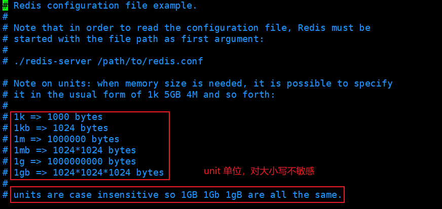

> INCLUDES 包含

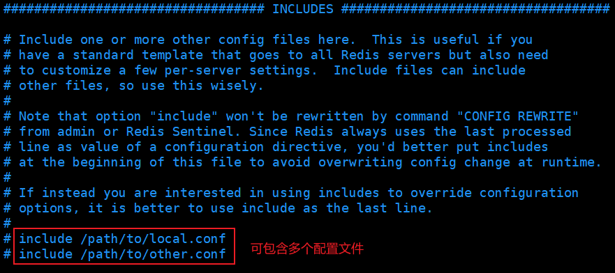

> NETWORK 网络

```bash
bind 127.0.0.1 		# 绑定的ip

protected-mode yes  # 保护模式

port 6379			# 端口号
```

> GENERAL 通用

```bash
# 以守护进程的方式运行，默认为no。通常需要手动设置为yes，在该模式下，redis会在后台运行
# docker环境中则不需要更改。Docker的容器需要其中的主进程一直在前端运行，使用daemonize的模式会使得container在运行后立即退出。幸运的是在Redis的配置文件中daemonize模式默认被关闭。如需运行daemon模式，应该在docker层面通过-d命令来进行。
daemonize no 

# daemonize 开启后，redis会在后台运行，并将进程pid号写入至pidfile设置的文件中，此时redis将一直运行，除非手动kill该进程。
pidfile /var/run/redis_6379.pid

# 日志
# Specify the server verbosity level.
# This can be one of:
# debug (a lot of information, useful for development/testing)
# verbose (many rarely useful info, but not a mess like the debug level)
# notice (moderately verbose, what you want in production probably)
# warning (only very important / critical messages are logged)
loglevel notice
logfile ""	 # 日志文件位置

databases 16 # 数据库数量，默认为 16 个数据库

always-show-logo yes # 是否总是显示logo

```

> SNAPSHOTTING 快照 

持久化：

在规定的时间内，执行了多少次操作，则会持久化到文件 **.rdb** **.aof**

redis 是内存数据库，如果没有持久化，那么数据断电即失

```bash
# 表示如果900秒（15分钟）内，至少有1个key发生变化（新增、修改和删除），则重写rdb文件（持久化）。以下雷同...
save 900 1	  # 15分钟
save 300 10	  # 5 分钟
save 60 10000 # 1 分钟

stop-writes-on-bgsave-error yes	# 持久化如果出错，是否还需要继续工作

rdbcompression yes	# 是否压缩rdb文件，需要消耗一些CPU资源

rdbchecksum yes	# 保存rdb文件时，是否进行错误的检查校验

dbfilename dump.rdb	# dump.rdb 默认rdb保存文件名称

dir ./	# rdb文件保存的目录
```

> SECURITY 安全

使用命令行设置密码：

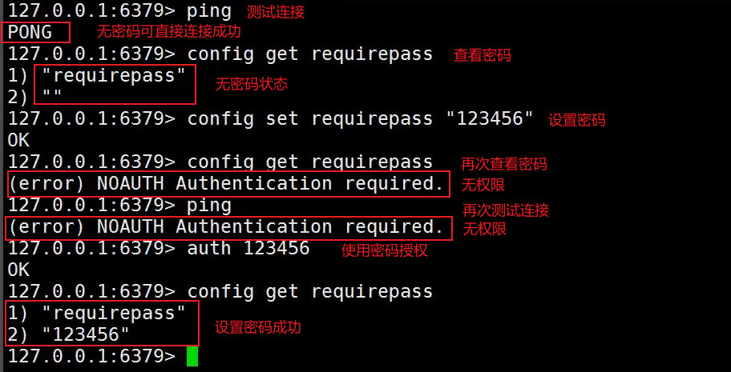

> CLIENTS 客户端

```bash
maxclients 10000 # 设置客户端最大连接数
```

> MEMORY MANAGEMENT 内存管理

```bash
maxmemory <bytes>	# 设置最大的内存容量

maxmemory-policy noeviction	 # 内存达到上限之后的处理策略
    # volatile-lru    只对设置了过期时间的key进行LRU 
    # allkeys-lru     删除lru算法的key   
    # volatile-random 随机删除即将过期key   
    # allkeys-random  随机删除   
    # volatile-ttl    删除即将过期的   
    # noeviction      永不过期，返回错误
```

> APPEND ONLY MODE （aof模式）

```bash
appendonly no # 默认是不开启aof模式的，默认使用rdb方式持久化，在大部分情况下，rdb完全够用
appendfilename "appendonly.aof" # aof方式持久化的文件名称

# appendfsync always # 每次修改都会sync 消耗性能
appendfsync everysec # 每秒执行一次sync 可能会丢失这一秒的数据
# appendfsync no	 # 不执行sync	    这时候操作系统自己同步数据，速度最快
```


## 持久化

Redis 是内存数据库，如果不将内存中的数据库状态保存到磁盘，那么一旦服务器进程退出，服务器中的数据库状态也会消失。所以Redis提供了持久化功能

### RDB（Redis DataBase）

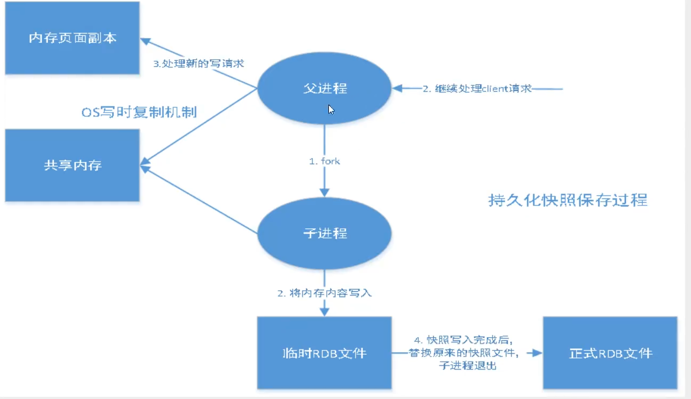

在指定的时间间隔内将内存中的数据集快照写入磁盘，也就是行话讲的Snapshot快照，它恢复时是将快照文件直接读到内存里，Redis会单独创建（fork）一个子进程来进行持久化，会先将数据写入到一个临时文件中，待持久化过程都结束了，再用这个临时文件替换上次持久化好的文件。

整个过程中，主进程是不进行任何IO操作的，这就确保了极高的性能。如果需要进行大规模数据的恢复，且对于数据恢复的完整性不是非常敏感，那RDB方式要比AOF方式更加的高效。RDB的缺点是最后一次持久化后的数据可能丢失。

我们默认情况下就是使用RDB，一般情况下不需要修改这个配置。RDB保存的文件名是 **dump.rdb**，有时候在生产环境中我们会将该文件进行备份

> 触发机制

- save 规则满足的条件下
- 执行 flushall 命令
- 退出 Redis 进程

以上都会触发rdb规则，产生 dump.rdb 文件

> 如何恢复rdb文件

- 只需将rdb文件放在Redis启动目录中即可，Redis启动时会自动检查**dump.rdb**文件恢复其中的数据
- 查看**dump.rdb**文件存放目录

```bash
127.0.0.1:6379> config get dir
1) "dir"
2) "/usr/local/bin"	# 如果该目录下存在 dump.rdb 文件，启动时就会自动恢复其中的数据
```

> 优缺点

**优点：**

- 适合大规模的数据恢复
- 对数据的完整性要求不高

**缺点：**

- 需要一定的时间间隔进行操作，如果Redis意外宕机，最后一次修改的数据就没有了
- fork进程时，会占用一定的内存空间

### AOF（Append Only File）

将我们的所有命令记录下来，相当于histroy，恢复时把该文件的所有命令全部执行一遍

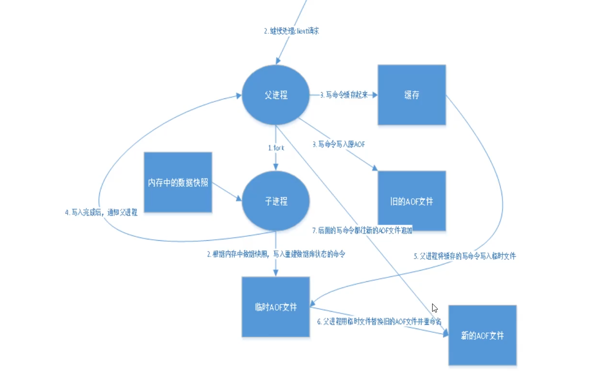

以日志的形式来记录每个写操作，将Redis执行的所有指令记录下来（读操作不记录），只许追加文件但不可以改写文件，redis启动之初会读取该文件重新构建数据，换之而言，Redis重启的话就根据日志文件的内容将写指令从前到后执行一次，以完成数据的恢复工作。

默认是不开启的，需要手动进行配置。AOF保存的文件名是 **appendonly.aof**，如果这个文件有错误，这时候Redis会启动失败，我们需要修复该文件，需要使用 **redis-check-aof** 工具进行修复

```bash
redis-check-aof --fix # 修复命令
```

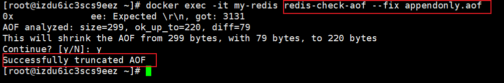

如果文件正常，重启Redis即可恢复

> 重写规则

因为 AOF 的运作方式是不断地将命令追加到文件的末尾， 所以随着写入命令的不断增加， AOF 文件的体积也会变得越来越大。

为了处理这种情况， Redis 支持一种有趣的特性： 可以在不打断服务客户端的情况下， 对 AOF 文件进行重建（rebuild）。 Redis 将生成一个新的 AOF 文件， 这个文件包含重建当前数据集所需的最少命令。

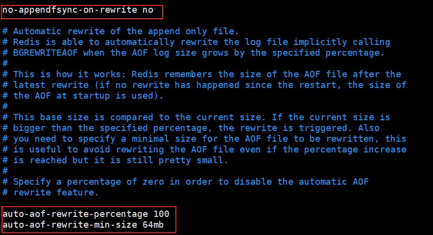

如果aof文件大于 64M ，将会触发重写机制

> 优缺点

**优点：**

- appendfsync always 每次修改都同步，文件的完整性会更好
- appendfsync everysec 每秒同步一次，可能会丢失一秒的数据
- appendfsync no 从不同步，效率最高

**缺点：**

- 相对于数据文件来说，aof远远大于rdb，修复速度也比rdb慢
- aof运行效率也比rdb慢，所以Redis默认的配置就是rdb持久化

### RDB、AOF总结

> RDB

RDB持久化方式能够在指定的时间间隔内对你的数据进行快照存储。

> AOF

AOF持久化方式记录每次对服务器写的操作，当服务器重启的时候会重新执行这些命令来恢复原始的数据，AOF命令以Redis协议追加保存每次写的操作到文件末尾。Redis还能对AOF文件进行后台重写，使得AOF文件的体积不至于过大。

> 只做缓存

如果你只希望你的数据在服务器运行的时候存在，你也可以不使用任何持久化方式。

> 同时开启两种持久化方式

- 在这种情况下，当Redis重启的时候会优先载入AOF文件来恢复原始的数据，因为在通常情况下AOF文件保存的数据集要比RDB文件保存的数据集要完整。
- RDB的数据不实时，同时使用两者时服务器重启也只会找AOF文件。那要不要只使用AOF呢？建议不要，因为RDB更适合用于备份数据库（AOF在不断变化不好备份），快速重启，而且不会有AOF可能潜在的bug，留着作为一个万一的手段。

> 性能建议

- 因为RDB文件只用作后备用途，建议只在Slave上持久化RDB文件，而且只要15分钟备份一次就够了，只保留save 900 1这条规则。
- 如果Enalbe AOF，好处是在最恶劣情况下也只会丢失不超过两秒数据，启动脚本较简单只load自己的AOF文件就可以了。代价一是带来了持续的IO，二是AOF rewrite的最后将rewrite过程中产生的新数据写到新文件造成的阻塞几乎是不可避免的。只要硬盘许可，应该尽量减少AOF rewrite的频率，AOF重写的基础大小默认值64M太小了，可以设到5G以上。默认超过原大小100%大小时重写可以改到适当的数值。
- 如果不Enable AOF ，仅靠Master-Slave Replication 实现高可用性也可以。能省掉一大笔IO也减少了rewrite时带来的系统波动。代价是如果Master/Slave同时宕掉，会丢失十几分钟的数据，启动脚本也要比较两个Master/Slave中的RDB文件，载入较新的那个。新浪微博就选用了这种架构。

## 发布订阅

Redis 发布订阅 (pub/sub) 是一种消息通信模式：发送者 (pub) 发送消息，订阅者 (sub) 接收消息。

Redis 客户端可以订阅任意数量的频道。

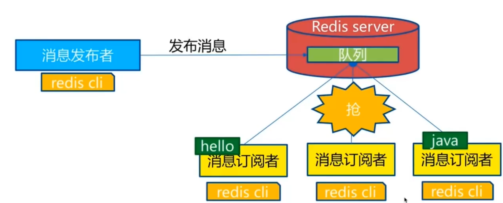

下图展示了频道 channel1 ， 以及订阅这个频道的三个客户端 —— client2 、 client5 和 client1 之间的关系：


当有新消息通过 PUBLISH 命令发送给频道 channel1 时， 这个消息就会被发送给订阅它的三个客户端：


订阅端：接收消息

```bash
# subscribe 订阅给定的一个或多个频道的信息
127.0.0.1:6379> subscribe moon	# 订阅一个频道 moon
Reading messages... (press Ctrl-C to quit) # 等待读取推送的消息
1) "subscribe"	 # 订阅
2) "moon"		 # 已订阅的频道
3) (integer) 1	 # 已订阅一个频道

# 接收第一次推送的消息
1) "message"	 # 消息
2) "moon"		 # 哪个频道的消息
3) "hello world" # 消息的具体内容

# 接收第二次推送的消息
1) "message"
2) "moon"
3) "Let me talking to the moon"
```

发送端：发送消息

```bash
# publish 将信息发送到指定的频道
127.0.0.1:6379> publish moon "hello world" # 发布者发布消息到指定的频道 第一次推送
(integer) 1
127.0.0.1:6379> publish moon "Let me talking to the moon"	# 第二次推送
(integer) 1
```

这些命令被广泛用于构建及时通讯应用，比如网络聊天室（chatroom）和实时广播、实时提醒...

> 原理

Redis是使用C实现的，通过分析 Redis 源码里的 pubsub.c 文件，了解发布和订阅机制的底层实现，籍此加深对 Redis 的理解。

Redis 通过 PUBLISH 、SUBSCRIBE 和 PSUBSCRIBE 等命令实现发布和订阅功能。通过 SUBSCRIBE 命令订阅某频道后，redis-server 里维护了一个字典，字典的键就是一个个频道！，而字典的值则是一个链表，链表中保存了所有订阅这个 channel 的客户端。SUBSCRIBE 命令的关键，就是将客户端添加到给定 channel 的订阅链表中。

通过 PUBLISH 命令向订阅者发送消息，redis-server 会使用给定的频道作为键，在它所维护的 channel字典中查找记录了订阅这个频道的所有客户端的链表，遍历这个链表，将消息发布给所有订阅者。

Pub/Sub 从字面上理解就是发布（Publish）与订阅（Subscribe），在Redis中，你可以设定对某一个key值进行消息发布及消息订阅，当一个key值上进行了消息发布后，所有订阅它的客户端都会收到相应的消息。这一功能最明显的用法就是用作实时消息系统，比如普通的即时聊天，群聊等功能。

>使用场景

- 实时消息系统
- 实时聊天（频道当做聊天室，将信息回显给所有人即可！）
- 订阅，关注...

稍微复杂的场景需要使用消息中间件 MQ...


## 主从复制

主从复制，是指将一台Redis服务器的数据，复制到其他的Redis服务器。前者称为主节点(master)，后者称为从节点(slave)，数据的复制是单向的，只能由主节点到从节点。 

默认情况下，每台Redis服务器都是主节点；且一个主节点可以有多个从节点(或没有从节点)，但一个从节点只能有一个主节点。

> 作用

1. 数据冗余：主从复制实现了数据的热备份，是持久化之外的一种数据冗余方式。
2. 故障恢复：当主节点出现问题时，可以由从节点提供服务，实现快速的故障恢复；实际上是一种服务的冗余。
3. 负载均衡：在主从复制的基础上，配合读写分离，可以由主节点提供写服务，由从节点提供读服务（即写Redis数据时应用连接主节点，读Redis数据时应用连接从节点），分担服务器负载；尤其是在写少读多的场景下，通过多个从节点分担读负载，可以大大提高Redis服务器的并发量。
4. 高可用（集群）基石：除了上述作用以外，主从复制还是哨兵和集群能够实施的基础，因此说主从复制是Redis高可用的基础。

在现有企业中80%公司大部分使用的是redis单机服务，在实际的场景当中单一节点的redis容易面临风险。

1、从结构上，单个Redis服务器会发生单点故障，并且一台服务器需要处理所有的请求负载，压力较大；

2、从容量上，单个Redis服务器内存容量有限，就算一台Redis服务器内存容量为256G，也不能将所有内存用作Redis存储内存，一般来说，单台Redis最大使用内存不应该超过20G。电商网站上的商品，一般都是一次上传，无数次浏览的，说专业点也就是"多读少写"。

对于这种场景，我们可以使如下这种架构：

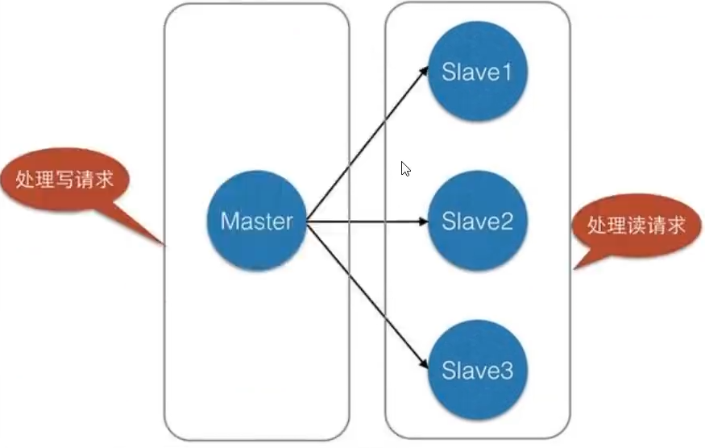

主从复制，读写分离！ 80% 的情况下都是在进行读操作，减缓服务器的压力。

> 环境配置

只配从库，不配主库（Redis默认本身就是主库）

一般情况下从机只需作以下4处配置修改即可，主机只需修改logfile、dbfilename两处。以下，以6380从机为例：

```bash
port 6379	# 端口号 port 6380

pidfile /var/run/redis_6379.pid # pid文件名 pidfile /var/run/redis_6380.pid

logfile ""	# 日志文件名 logfile "6380.log"

dbfilename dump.rdb # rdb文件名 dbfilename dump6380.rdb
```

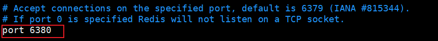

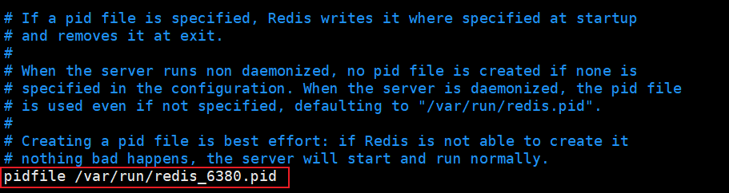

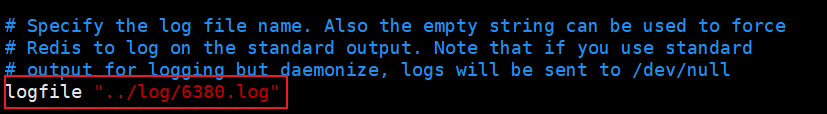

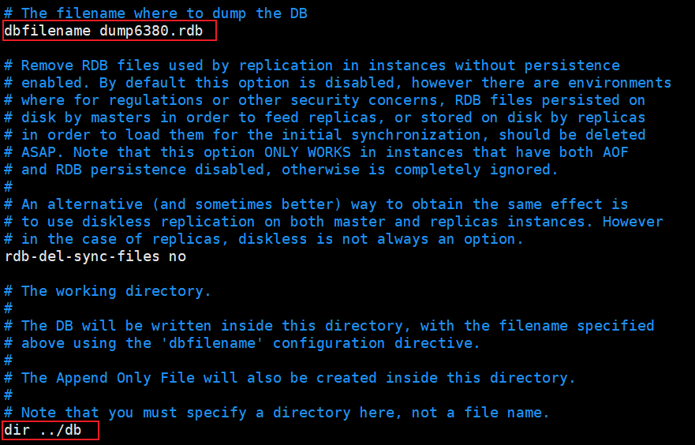

此时修改完三个配置文件后，即可启动三个Redis服务

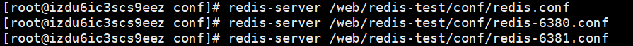

查看Redis进程信息

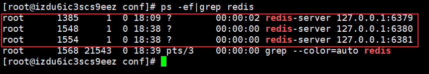

### 一主二从

**默认情况下，每台Redis服务器都是主节点，只配置从机即可**

此时通过 **info replication** 命令可以看到当前3台redis都是master角色

开始配置一主（6379）二从（6380，6381）

```bash
# 6379主机初始信息
127.0.0.1:6379> info replication # 查看当前库主/从复制信息
# Replication
role:master			# 当前角色：master（主机）
connected_slaves:0  # 0 没有从机
master_replid:c2be5ba97770b2ea0c16c695df5223b5ef3c2917
master_replid2:0000000000000000000000000000000000000000
master_repl_offset:0
second_repl_offset:-1
repl_backlog_active:0
repl_backlog_size:1048576
repl_backlog_first_byte_offset:0
repl_backlog_histlen:0
```

```bash
# 配置从机6380（6381从机配置与此一致）
# slaveof 将当前服务器转变为指定服务器的从属服务器(slave server)
127.0.0.1:6380> slaveof 127.0.0.1 6379 # slaveof master_host port
OK
127.0.0.1:6380> info replication
# Replication
role:slave	 		  # 当前角色：slave（从机）
master_host:127.0.0.1 # 主机IP
master_port:6379	  # 主机端口号
master_link_status:up # 主机状态：up（开启）
master_last_io_seconds_ago:7
master_sync_in_progress:0
slave_repl_offset:0
slave_priority:100
slave_read_only:1
connected_slaves:0
master_replid:ba3d40de9ea98258c34302852ea85441e997b0e5
master_replid2:0000000000000000000000000000000000000000
master_repl_offset:0
second_repl_offset:-1
repl_backlog_active:1
repl_backlog_size:1048576
repl_backlog_first_byte_offset:1
repl_backlog_histlen:0
```

```bash
# 两台从机加入后，此时6379主机的相关信息
127.0.0.1:6379> info replication
# Replication
role:master
connected_slaves:2	# 2台从机连接
slave0:ip=127.0.0.1,port=6380,state=online,offset=686,lag=0	# 从机1 相关信息
slave1:ip=127.0.0.1,port=6381,state=online,offset=686,lag=0 # 从机2 相关信息
master_replid:ba3d40de9ea98258c34302852ea85441e997b0e5
master_replid2:0000000000000000000000000000000000000000
master_repl_offset:686
second_repl_offset:-1
repl_backlog_active:1
repl_backlog_size:1048576
repl_backlog_first_byte_offset:1
repl_backlog_histlen:686
```

**真实的主从配置应该在 redis.conf 配置文件中进行配置，这样才是永久生效的；此次使用的是命令行进行配置，只是暂时的**

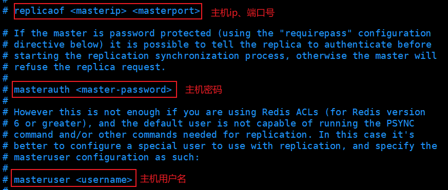

> 相关细节

主机可以写，从机不能写只能读。主机中的所有信息和数据，都会自动被从机保存

主机写：

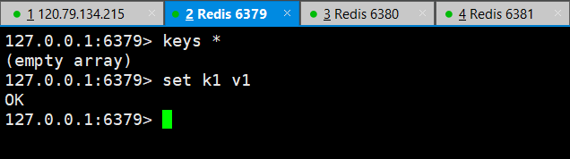

从机只能读：

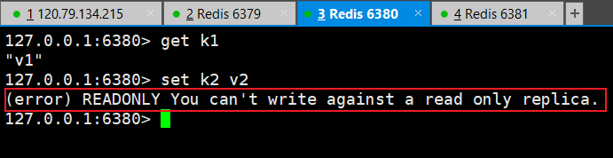

主机中途断开连接，从机依旧能连接到主机，但是没有写操作了；如果主机重新连接上，从机依旧可以直接获取到主机写的信息。

如果使用的是命令行方式配置的主从，这时候如果从机重启了，则会变回主机；只要重新配置为从机，则可以重新获取到主机的信息

> 复制原理

Slave 启动成功连接到 master 后会发送一个 sync 同步命令；

Master 接到命令，启动后台的存盘进程，同时收集所有接收到的用于修改数据集命令，在后台进程执行完毕之后，master将传送整个数据文件到slave，并完成一次完全同步。

**全量复制：**slave 服务在接收到数据库文件数据后，将其存盘并加载到内存中

**增量复制：**Master 继续将新的所有收集到的修改命令依次传给slave，完成同步

只要是重新连接master，一次完全同步（全量复制）将被自动执行！ 我们的数据一定可以在从机中看到！

> 层层链路

上一个 M 连接下一个 S，这时候也可以完成主从复制

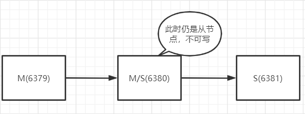

> 宕机后手动配置主机

如果主机断开了连接，从机可以使用 **slaveof no one** ，让自己变成主机。此时，其他的节点需手动连接到这个最新的主节点

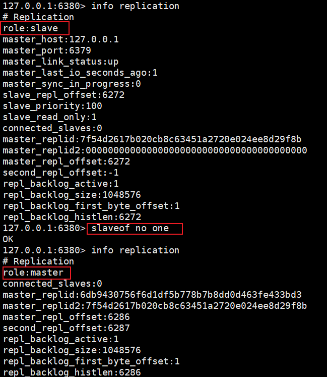

### 哨兵模式

主从切换技术的方法是：当主服务器宕机后，需要手动把一台从服务器切换为主服务器，这就需要人工干预，费时费力，还会造成一段时间内服务不可用。这不是一种推荐的方式，更多时候，我们优先考虑哨兵模式。Redis从2.8开始正式提供了Sentinel（哨兵） 架构来解决这个问题。

哨兵模式是一种特殊的模式，首先Redis提供了哨兵的命令，哨兵是一个独立的进程，作为进程，它会独立运行。其原理是**哨兵通过发送命令，等待Redis服务器响应，从而监控运行的多个Redis实例**。

哨兵模式能够后台监控主机是否故障，如果故障了根据投票数**自动将从库转换为主库**。


这里的哨兵有两个作用

1.通过发送命令，让Redis服务器返回监控其运行状态，包括主服务器和从服务器。

2.当哨兵监测到master宕机，会自动将slave切换成master，然后通过**发布订阅模式**通知其他的从服务器，修改配置文件，让它们切换主机。

然而一个哨兵进程对Redis服务器进行监控，可能会出现问题，为此，我们可以使用多个哨兵进行监控。各个哨兵之间还会进行监控，这样就形成了多哨兵模式。


> 故障切换（failover）的过程

假设主服务器宕机，哨兵1先检测到这个结果，系统并不会马上进行failover过程，仅仅是哨兵1主观的认为主服务器不可用，这个现象成为**主观下线**。当后面的哨兵也检测到主服务器不可用，并且数量达到一定值时，那么哨兵之间就会进行一次投票，投票的结果由一个哨兵发起，进行failover操作。切换成功后，就会通过发布订阅模式，让各个哨兵把自己监控的从服务器实现切换主机，这个过程称为**客观下线**。这样对于客户端而言，一切都是透明的。

> 启动哨兵模式

新增哨兵配置文件 **sentinel.conf**

```bash
# sentinel monitor 被监控的名称 host port 1
# 1 代表主机宕机后，slave投票让谁接替成为主机，票数最多的，则成为主机
sentinel monitor myredis 127.0.0.1 6379 1
```

启动哨兵模式 **redis-sentinel**

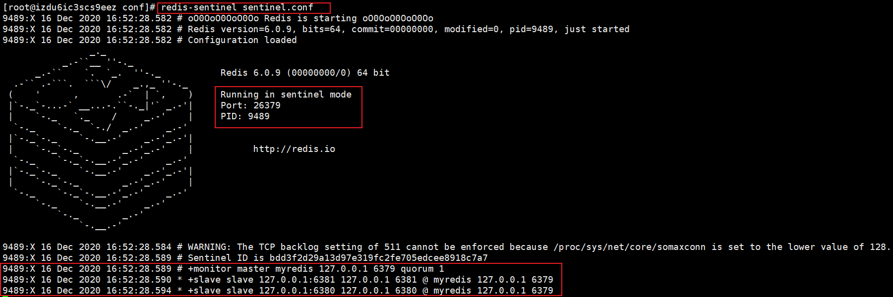

如果 Master 节点断开后，会从从机中随机选择一个服务器作为主节点（投票算法）

此时6379断开连接后，6380自动被选为主节点

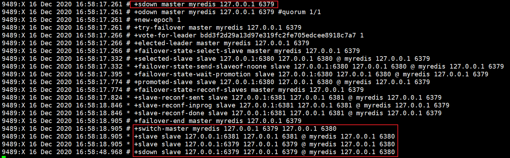

原主机重新连接后将被当做从机，这就是哨兵模式的规则

6379重新连接后，将被当做 slave


> 优缺点

优点：

- 哨兵集群，基于主从复制模式，所有的主从配置优点，它全有
- 主从可以切换，故障可以转移，系统的可用性就会更好
- 哨兵模式就是主从模式的升级，从手动到自动，更加健壮

缺点：

- Redis 不好在线扩容，集群容量一旦到达上限，在线扩容就十分麻烦
- 实现哨兵模式的配置其实是很麻烦的，里面有很多选择配置

> 哨兵模式的全配置

```bash
# Example sentinel.conf

# 哨兵sentinel实例运行的端口 默认26379 port 26379

# 哨兵sentinel的工作目录
dir /tmp

# 哨兵sentinel监控的redis主节点的 ip port
# master-name	可以自己命名的主节点名字 只能由字母A-z、数字0-9 、这三个字符".-_"组成。# quorum 配置多少个sentinel哨兵统一认为master主节点失联 那么这时客观上认为主节点失联了# sentinel monitor <master-name> <ip> <redis-port> <quorum>
sentinel monitor mymaster 127.0.0.1 6379 2

# 当在Redis实例中开启了requirepass foobared 授权密码 这样所有连接Redis实例的客户端都要提供密 码                                                                                          # 设置哨兵sentinel 连接主从的密码 注意必须为主从设置一样的验证密码
# sentinel auth-pass <master-name> <password>
sentinel auth-pass mymaster MySUPER--secret-0123passw0rd

# 指定多少毫秒之后 主节点没有应答哨兵sentinel 此时 哨兵主观上认为主节点下线 默认30秒
# sentinel down-after-milliseconds <master-name> <milliseconds> sentinel down-after-milliseconds mymaster 30000

# 这个配置项指定了在发生failover主备切换时最多可以有多少个slave同时对新的master进行 同步，这个数字越小，完成failover所需的时间就越长，
但是如果这个数字越大，就意味着越 多的slave因为replication而不可用。
可以通过将这个值设为 1 来保证每次只有一个slave 处于不能处理命令请求的状态。
# sentinel parallel-syncs <master-name> <numslaves> sentinel parallel-syncs mymaster 1

# 故障转移的超时时间 failover-timeout 可以用在以下这些方面：
#1. 同一个sentinel对同一个master两次failover之间的间隔时间。
#2.  当一个slave从一个错误的master那里同步数据开始计算时间。直到slave被纠正为向正确的master那里同步数据时。
#3.当想要取消一个正在进行的failover所需要的时间。
#4.当进行failover时，配置所有slaves指向新的master所需的最大时间。不过，即使过了这个超时，
slaves依然会被正确配置为指向master，但是就不按parallel-syncs所配置的规则来了
# 默认三分钟
# sentinel failover-timeout <master-name> <milliseconds>

sentinel failover-timeout mymaster 180000


# SCRIPTS EXECUTION

#配置当某一事件发生时所需要执行的脚本，可以通过脚本来通知管理员，例如当系统运行不正常时发邮件通知  相关人员。                                                                                     #对于脚本的运行结果有以下规则：
#若脚本执行后返回1，那么该脚本稍后将会被再次执行，重复次数目前默认为10
#若脚本执行后返回2，或者比2更高的一个返回值，脚本将不会重复执行。
#如果脚本在执行过程中由于收到系统中断信号被终止了，则同返回值为1时的行为相同。
#一个脚本的最大执行时间为60s，如果超过这个时间，脚本将会被一个SIGKILL信号终止，之后重新执行。

#通知型脚本:当sentinel有任何警告级别的事件发生时（比如说redis实例的主观失效和客观失效等等），  将会去调用这个脚本，这时这个脚本应该通过邮件，SMS等方式去通知系统管理员关于系统不正常运行的信息。调用该脚本时，将传给脚本两个参数，一个是事件的类型，一个是事件的描述。如果sentinel.conf配  置文件中配置了这个脚本路径，那么必须保证这个脚本存在于这个路径，并且是可执行的，否则sentinel无  法正常启动成功。
#通知脚本
# sentinel notification-script <master-name> <script-path> sentinel notification-script mymaster /var/redis/notify.sh

# 客户端重新配置主节点参数脚本
#  当一个master由于failover而发生改变时，这个脚本将会被调用，通知相关的客户端关于master地址已经发生改变的信息。
# 以下参数将会在调用脚本时传给脚本:
# <master-name> <role> <state> <from-ip> <from-port> <to-ip> <to-port>
# 目前<state>总是“failover”,
# <role>是“leader”或者“observer”中的一个。
# 参数 from-ip, from-port, to-ip, to-port是用来和旧的master和新的master(即旧的slave)通信的
# 这个脚本应该是通用的，能被多次调用，不是针对性的。
# sentinel client-reconfig-script <master-name> <script-path>
sentinel client-reconfig-script mymaster /var/redis/reconfig.sh
```

## 缓存穿透和雪崩

Redis缓存的使用，极大的提升了应用程序的性能和效率，特别是数据查询方面。但同时，它也带来了一 些问题。其中，最要害的问题，就是数据的一致性问题，从严格意义上讲，这个问题无解。如果对数据的一致性要求很高，那么就不能使用缓存。
另外的一些典型问题就是，缓存穿透、缓存雪崩和缓存击穿。目前，业界也都有比较流行的解决方案。

### 缓存穿透（查不到）

缓存穿透的概念很简单，用户想要查询一个数据，发现redis内存数据库没有，也就是缓存没有命中，于是向持久层数据库查询。发现也没有，于是本次查询失败。当用户很多的时候，缓存都没有命中（秒杀），于是都去请求了持久层数据库。这会给持久层数据库造成很大的压力，这时候就相当于出现了缓存穿透。

> 解决方案

**布隆过滤器**

布隆过滤器是一种数据结构，对所有可能查询的参数以hash形式存储，在控制层先进行校验，不符合则丢弃，从而避免了对底层存储系统的查询压力

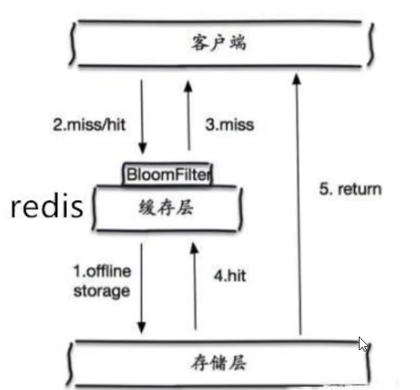

**缓存空对象**

当存储层不命中后，即使返回的空对象也将其缓存起来，同时会设置一个过期时间，之后再访问这个数据将会从缓存中获取，保护了后端数据源

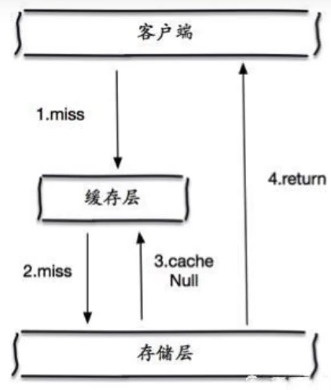

但是这种方法会存在两个问题：

1. 如果空值能够被缓存起来，这就意味着缓存需要更多的空间存储更多的键，因为这当中可能会有很多 的空值的键
2. 即使对空值设置了过期时间，还是会存在缓存层和存储层的数据会有一段时间窗口的不一致，这对于 需要保持一致性的业务会有影响

### 缓存击穿（量太大，缓存过期）

缓存击穿，是指一个key非常热点，在不停的扛着大并发，大并发集中 对这一个点进行访问，当这个key在失效的瞬间，持续的大并发就穿破缓存，直接请求数据库，就像在一 个屏障上凿开了一个洞。
当某个key在过期的瞬间，有大量的请求并发访问，这类数据一般是热点数据，由于缓存过期，会同时访 问数据库来查询最新数据，并且回写缓存，会导使数据库瞬间压力过大。

> 解决方案

**设置热点数据永不过期**

从缓存层面来看，没有设置过期时间，所以不会出现热点 key 过期后产生的问题

**加互斥锁**

分布式锁：使用分布式锁，保证对于每个key同时只有一个线程去查询后端服务，其他线程没有获得分布式锁的权限，因此只需要等待即可。这种方式将高并发的压力转移到了分布式锁，因此对分布式锁的考验很大

### **缓存雪崩**

缓存雪崩，是指在某一个时间段，缓存集中过期失效。
产生雪崩的原因之一，比如在写本文的时候，马上就要到双十二零点，很快就会迎来一波抢购，这波商品时间比较集中的放入了缓存，假设缓存一个小时。那么到了凌晨一点钟的时候，这批商品的缓存就都过期了。而对这批商品的访问查询，都落到了数据库上，对于数据库而言，就会产生周期性的压力波峰。于是所有的请求都会达到存储层，存储层的调用量会暴增，造成存储层也会挂掉的情况

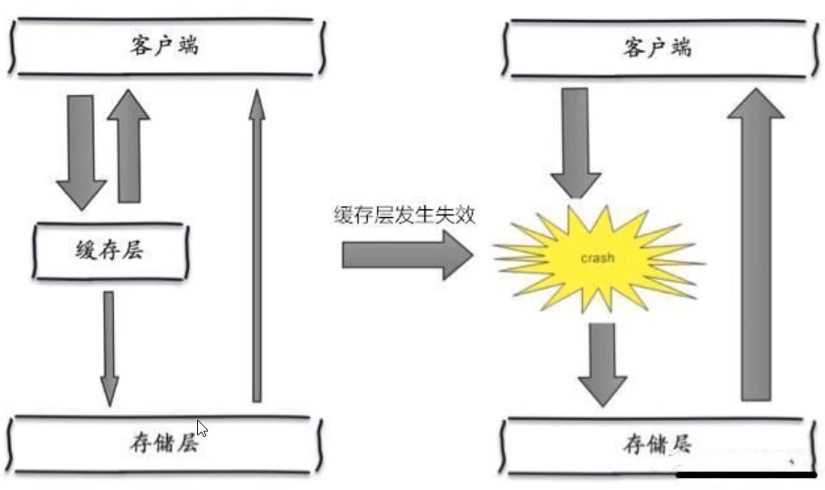

其实集中过期，倒不是非常致命，比较致命的缓存雪崩，是缓存服务器某个节点宕机或断网。因为自然 形成的缓存雪崩，一定是在某个时间段集中创建缓存，这个时候，数据库也是可以顶住压力的。无非就是对数据库产生周期性的压力而已。而缓存服务节点的宕机，对数据库服务器造成的压力是不可预知 的，很有可能瞬间就把数据库压垮。

（发生雪崩的时候，每一片雪花都在勇闯天涯，没有一片雪花是无辜的）

**Redis 高可用**

这个思想的含义是，既然redis有可能挂掉，那我多增设几台redis，这样一台挂掉之后其他的还可以继续工作，其实就是搭建的集群

**限流降级**

这个解决方案的思想是，在缓存失效后，通过加锁或者队列来控制读数据库写缓存的线程数量。比如对某个key只允许一个线程查询数据和写缓存，其他线程等待

**数据预热**

数据加热的含义就是在正式部署之前，我先把可能的数据先预先访问一遍，这样部分可能大量访问的数据就会加载到缓存中。在即将发生大并发访问前手动触发加载缓存不同的key，设置不同的过期时间，让缓存失效的时间点尽量均匀

